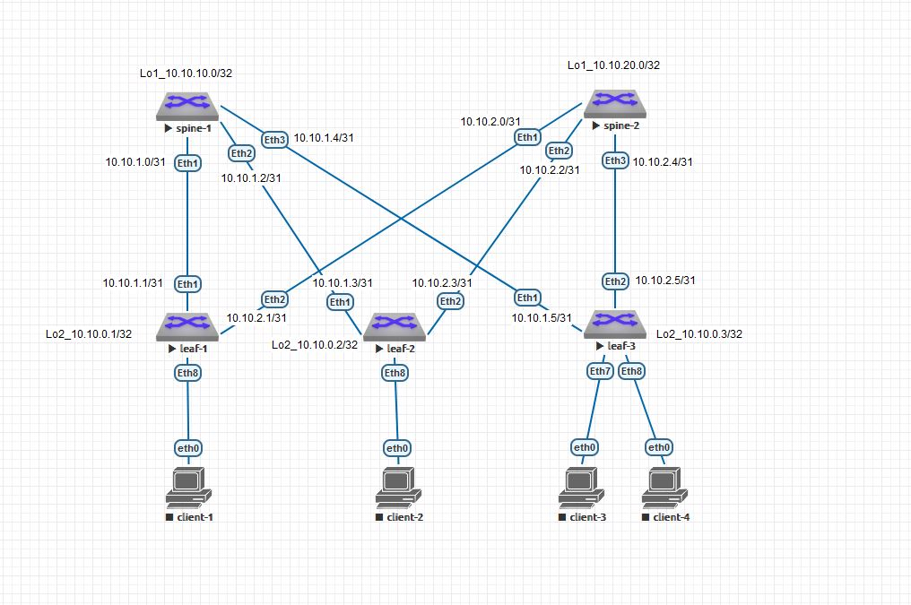

# Домашнее задание
Проектирование адресного пространства
Схема CLOS



Адресация сети

|hostname|	interface |	IP/MASK	     |  Description|
| -------|------------|--------------|-------------|
|spine-1 |	Ethernet1 |	10.10.1.0/31 |	leaf-1     |
|spine-1 |	Ethernet2 |	10.10.1.2/31 |	leaf-2     |
|spine-1 |	Ethernet3 |	10.10.1.4/31 |	leaf-3     |
|spine-1 |	Loopback1 |	10.10.10.0/3 |	           |
|                                                  |
|spine-2 |	Ethernet1 |	10.10.2.0/31 |	leaf-1     |
|spine-2 |	Ethernet2 |	10.10.2.2/31 |	leaf-2     |
|spine-2 |	Ethernet3 |	10.10.2.4/31 |	leaf-3     |
|spine-2 |	Loopback1 |		         |             |
|                                                  |
|leaf-1  |	Ethernet1 |	10.10.1.1/31 |	spine-1    |
|leaf-1  |	Ethernet2 |	10.10.2.1/31 |	spine-2    |
|leaf-1  |	Loopback2 |	10.10.0.1/32 |	           |
|                                                  |
|leaf-2  |	Ethernet1 |	10.10.1.3/31 |	spine-1    |
|leaf-2  |	Ethernet2 |	10.10.2.3/31 |	spine-2    |
|leaf-2  |	Loopback2 |	10.10.0.2/32 |	           |
|                                                  |
|leaf-3  |	Ethernet1 |	10.10.1.5/31 |	spine-1    |
|leaf-3  |	Ethernet2 |	10.10.2.5/31 |	spine-2    |
|leaf-3  |	Loopback2 |	10.10.0.3/32 |	           |


### Конфигурация оборудования

- #### [spine-1](Config/spine/spine-1.conf)

```
!
hostname spine1
!
interface Ethernet1
   description leaf-1
   no switchport
   ip address 10.10.1.0/31
!
interface Ethernet2
   description leaf-2
   no switchport
   ip address 10.10.1.2/31
!
interface Ethernet3
   description leaf-3
   no switchport
   ip address 10.10.1.4/31
!
interface Loopback1
   ip address 10.10.10.0/32
!
```
- #### [spine-2](Config/spine/spine-2.conf)

```
!
hostname spine-2
!
interface Ethernet1
   description leaf-1
   no switchport
   ip address 10.10.2.0/31
!
interface Ethernet2
   description leaf-2
   no switchport
   ip address 10.10.2.2/31
!
interface Ethernet3
   description leaf-3
   no switchport
   ip address 10.10.2.4/31
!
interface Loopback1
   ip address 10.10.20.0/32
!
```
- #### [leaf-1](Config/leaf/leaf-1.conf)
```
!
hostname leaf-1
!
interface Ethernet1
   description spine-1
   no switchport
   ip address 10.10.1.1/31
!
interface Ethernet2
   description spine-2
   no switchport
   ip address 10.10.2.1/31
!
interface Loopback2
   ip address 10.10.0.1/32
!

```
- #### [leaf-2](Config/leaf/leaf-2.conf)
```
!
hostname leaf-2
!
interface Ethernet1
   description spine-1
   no switchport
   ip address 10.10.1.3/31
!
interface Ethernet2
   description spine-2
   no switchport
   ip address 10.10.2.3/31
!
interface Loopback2
   ip address 10.10.0.2/32
!
```
- #### [leaf-3](Config/leaf/leaf-3.conf)
```
!
hostname leaf-3
!
interface Ethernet1
   description spine-1
   no switchport
   ip address 10.10.1.5/31
!
interface Ethernet2
   description spine-2
   no switchport
   ip address 10.10.2.5/31
!
interface Loopback2
   ip address 10.10.0.3/32
!
```

### Проверка на доступность
- #### spine-1

```
spine1#ping 10.10.1.1
PING 10.10.1.1 (10.10.1.1) 72(100) bytes of data.
80 bytes from 10.10.1.1: icmp_seq=1 ttl=64 time=4.03 ms
80 bytes from 10.10.1.1: icmp_seq=2 ttl=64 time=2.91 ms
80 bytes from 10.10.1.1: icmp_seq=3 ttl=64 time=2.76 ms
80 bytes from 10.10.1.1: icmp_seq=4 ttl=64 time=2.69 ms
80 bytes from 10.10.1.1: icmp_seq=5 ttl=64 time=2.62 ms
--- 10.10.1.1 ping statistics ---
5 packets transmitted, 5 received, 0% packet loss, time 20ms
rtt min/avg/max/mdev = 2.625/3.004/4.030/0.524 ms, ipg/ewma 5.205/3.493 ms

spine1#ping 10.10.1.3
PING 10.10.1.3 (10.10.1.3) 72(100) bytes of data.
80 bytes from 10.10.1.3: icmp_seq=1 ttl=64 time=4.44 ms
80 bytes from 10.10.1.3: icmp_seq=2 ttl=64 time=2.56 ms
80 bytes from 10.10.1.3: icmp_seq=3 ttl=64 time=2.90 ms
80 bytes from 10.10.1.3: icmp_seq=4 ttl=64 time=2.47 ms
80 bytes from 10.10.1.3: icmp_seq=5 ttl=64 time=2.50 ms
--- 10.10.1.3 ping statistics ---
5 packets transmitted, 5 received, 0% packet loss, time 20ms
rtt min/avg/max/mdev = 2.473/2.977/4.441/0.749 ms, ipg/ewma 5.037/3.679 ms

spine1#ping 10.10.1.5
PING 10.10.1.5 (10.10.1.5) 72(100) bytes of data.
80 bytes from 10.10.1.5: icmp_seq=1 ttl=64 time=3.58 ms
80 bytes from 10.10.1.5: icmp_seq=2 ttl=64 time=2.67 ms
80 bytes from 10.10.1.5: icmp_seq=3 ttl=64 time=2.59 ms
80 bytes from 10.10.1.5: icmp_seq=4 ttl=64 time=2.55 ms
80 bytes from 10.10.1.5: icmp_seq=5 ttl=64 time=3.19 ms
--- 10.10.1.5 ping statistics ---
5 packets transmitted, 5 received, 0% packet loss, time 20ms
rtt min/avg/max/mdev = 2.551/2.919/3.583/0.406 ms, ipg/ewma 5.128/3.251 ms
```

- #### spine-2
```
spine-2#ping 10.10.2.1
PING 10.10.2.1 (10.10.2.1) 72(100) bytes of data.
80 bytes from 10.10.2.1: icmp_seq=1 ttl=64 time=30.9 ms
80 bytes from 10.10.2.1: icmp_seq=2 ttl=64 time=19.6 ms
80 bytes from 10.10.2.1: icmp_seq=3 ttl=64 time=16.2 ms
80 bytes from 10.10.2.1: icmp_seq=4 ttl=64 time=6.01 ms
80 bytes from 10.10.2.1: icmp_seq=5 ttl=64 time=2.77 ms

--- 10.10.2.1 ping statistics ---
5 packets transmitted, 5 received, 0% packet loss, time 79ms
rtt min/avg/max/mdev = 2.779/15.120/30.913/10.063 ms, pipe 3, ipg/ewma 19.863/22.326 ms
spine-2#ping 10.10.2.3
PING 10.10.2.3 (10.10.2.3) 72(100) bytes of data.
80 bytes from 10.10.2.3: icmp_seq=1 ttl=64 time=28.7 ms
80 bytes from 10.10.2.3: icmp_seq=2 ttl=64 time=15.3 ms
80 bytes from 10.10.2.3: icmp_seq=3 ttl=64 time=7.51 ms
80 bytes from 10.10.2.3: icmp_seq=4 ttl=64 time=2.59 ms
80 bytes from 10.10.2.3: icmp_seq=5 ttl=64 time=2.82 ms

--- 10.10.2.3 ping statistics ---
5 packets transmitted, 5 received, 0% packet loss, time 77ms
rtt min/avg/max/mdev = 2.592/11.400/28.711/9.815 ms, pipe 3, ipg/ewma 19.251/19.471 ms
spine-2#ping 10.10.2.5
PING 10.10.2.5 (10.10.2.5) 72(100) bytes of data.
80 bytes from 10.10.2.5: icmp_seq=1 ttl=64 time=27.9 ms
80 bytes from 10.10.2.5: icmp_seq=2 ttl=64 time=19.1 ms
80 bytes from 10.10.2.5: icmp_seq=3 ttl=64 time=10.4 ms
80 bytes from 10.10.2.5: icmp_seq=4 ttl=64 time=3.18 ms
80 bytes from 10.10.2.5: icmp_seq=5 ttl=64 time=2.97 ms

--- 10.10.2.5 ping statistics ---
5 packets transmitted, 5 received, 0% packet loss, time 71ms
rtt min/avg/max/mdev = 2.970/12.739/27.944/9.637 ms, pipe 3, ipg/ewma 17.977/19.703 ms
```
