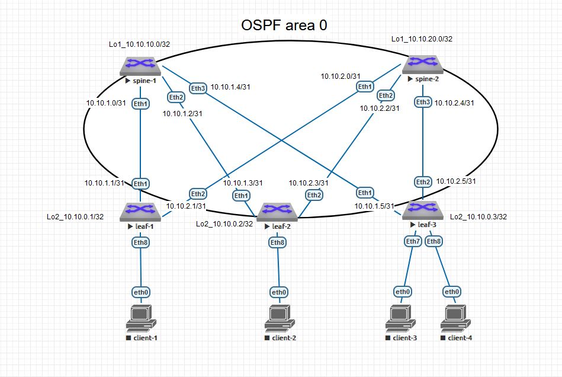

# Домашнее задание №2
### Underlay. OSPF


### Схема сети




### Конфигурация оборудования

- ### [spine-1](Config/spine-1.conf)
```
hostname spine1
!
spanning-tree mode mstp
!
interface Ethernet1
   description leaf-1
   no switchport
   ip address 10.10.1.0/31
   ip ospf network point-to-point
   ip ospf area 0.0.0.0
!
interface Ethernet2
   description leaf-2
   no switchport
   ip address 10.10.1.2/31
   ip ospf network point-to-point
   ip ospf area 0.0.0.0
!
interface Ethernet3
   description leaf-3
   no switchport
   ip address 10.10.1.4/31
   ip ospf network point-to-point
   ip ospf area 0.0.0.0
!
interface Loopback1
   ip address 10.10.10.0/32
   ip ospf area 0.0.0.0
!ip routing
!
router ospf 1
   router-id 10.10.10.0
   passive-interface default
   no passive-interface Ethernet1
   no passive-interface Ethernet2
   no passive-interface Ethernet3
   no passive-interface Loopback1
   max-lsa 12000
!
ip ospf router-id output-format hostnames
!
```

- ### [spine-2](Config/spine-2.conf)

```
hostname spine-2
!
spanning-tree mode mstp
!
interface Ethernet1
   description leaf-1
   no switchport
   ip address 10.10.2.0/31
   ip ospf network point-to-point
   ip ospf area 0.0.0.0
!
interface Ethernet2
   description leaf-2
   no switchport
   ip address 10.10.2.2/31
   ip ospf network point-to-point
   ip ospf area 0.0.0.0
!
interface Ethernet3
   description leaf-3
   no switchport
   ip address 10.10.2.4/31
   ip ospf network point-to-point
   ip ospf area 0.0.0.0
!
interface Loopback1
   ip address 10.10.20.0/32
   ip ospf area 0.0.0.0
!
ip routing
!
router ospf 1
   router-id 10.10.20.0
   passive-interface default
   no passive-interface Ethernet1
   no passive-interface Ethernet2
   no passive-interface Ethernet3
   no passive-interface Loopback1
   max-lsa 12000
!
ip ospf router-id output-format hostnames
!
```

- ### [leaf-1](Config/leaf-1.conf)
```
hostname leaf-1
!
spanning-tree mode mstp
!
interface Ethernet1
   description spine-1
   no switchport
   ip address 10.10.1.1/31
   ip ospf network point-to-point
   ip ospf area 0.0.0.0
!
interface Ethernet2
   description spine-2
   no switchport
   ip address 10.10.2.1/31
   ip ospf network point-to-point
   ip ospf area 0.0.0.0
!
interface Loopback2
   ip address 10.10.0.1/32
   ip ospf area 0.0.0.0
!
ip routing
!
router ospf 1
   router-id 10.10.0.1
   passive-interface default
   no passive-interface Ethernet1
   no passive-interface Ethernet2
   no passive-interface Loopback2
   max-lsa 12000
!
ip ospf router-id output-format hostnames
!
```

- ### [leaf-2](Config/leaf-2.conf)
```
hostname leaf-2
!
spanning-tree mode mstp
!
interface Ethernet1
   description spine-1
   no switchport
   ip address 10.10.1.3/31
   ip ospf network point-to-point
   ip ospf area 0.0.0.0
!
interface Ethernet2
   description spine-2
   no switchport
   ip address 10.10.2.3/31
   ip ospf network point-to-point
   ip ospf area 0.0.0.0
!
interface Loopback2
   ip address 10.10.0.2/32
   ip ospf area 0.0.0.0
!
ip routing
!
router ospf 1
   router-id 10.10.0.2
   passive-interface default
   no passive-interface Ethernet1
   no passive-interface Ethernet2
   no passive-interface Loopback2
   max-lsa 12000
!
ip ospf router-id output-format hostnames
!
```

- ### [leaf-3](Config/leaf-3.conf)
```
hostname leaf-3
!
spanning-tree mode mstp
!
interface Ethernet1
   description spine-1
   no switchport
   ip address 10.10.1.5/31
   ip ospf network point-to-point
   ip ospf area 0.0.0.0
!
interface Ethernet2
   description spine-2
   no switchport
   ip address 10.10.2.5/31
   ip ospf network point-to-point
   ip ospf area 0.0.0.0
!
!
interface Loopback2
   ip address 10.10.0.3/32
   ip ospf area 0.0.0.0
!
ip routing
!
router ospf 1
   router-id 10.10.0.3
   passive-interface default
   no passive-interface Ethernet1
   no passive-interface Ethernet2
   no passive-interface Loopback2
   max-lsa 12000
!
ip ospf router-id output-format hostnames
!
```

### Проверка связности устройства по протоколу OSPF

- ### spine-1
```
spine1#sho ip ospf neighbor
Neighbor ID     Instance VRF      Pri State                  Dead Time   Address         Interface
10.10.0.1       1        default  0   FULL                   00:00:35    10.10.1.1       Ethernet1
10.10.0.2       1        default  0   FULL                   00:00:30    10.10.1.3       Ethernet2
10.10.0.3       1        default  0   FULL                   00:00:34    10.10.1.5       Ethernet3
```

- ### spine-2
```
spine-2#sho ip ospf neighbor
Neighbor ID     Instance VRF      Pri State                  Dead Time   Address         Interface
10.10.0.2       1        default  0   FULL                   00:00:37    10.10.2.3       Ethernet2
10.10.0.1       1        default  0   FULL                   00:00:36    10.10.2.1       Ethernet1
10.10.0.3       1        default  0   FULL                   00:00:37    10.10.2.5       Ethernet3
```
