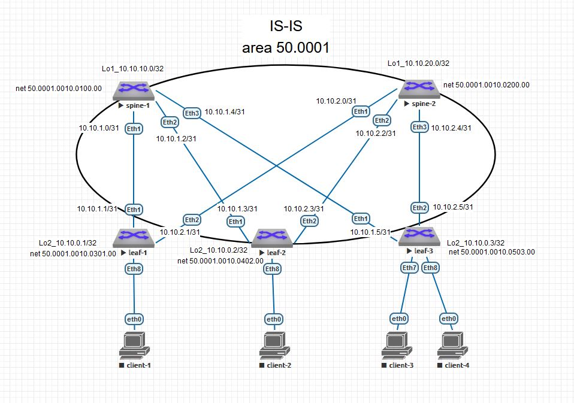

# Домашнее задание №3
### Настроить IS-IS для Underlay сети


### Схема сети



#
### Конфигурация оборудования

- ### [spine-1](Config/spine-1.conf)
```
hostname spine1
!
spanning-tree mode mstp
!
interface Ethernet1
   description leaf-1
   no switchport
   ip address 10.10.1.0/31
   isis enable Underlay
   isis circuit-type level-1
   isis network point-to-point
!
interface Ethernet2
   description leaf-2
   no switchport
   ip address 10.10.1.2/31
   isis enable Underlay
   isis circuit-type level-1
   isis network point-to-point
!
interface Ethernet3
   description leaf-3
   no switchport
   ip address 10.10.1.4/31
   isis enable Underlay
   isis circuit-type level-1
   isis network point-to-point
!
interface Loopback1
   ip address 10.10.10.0/32
   isis enable Underlay
!
interface Management1
!
ip routing
!
router isis Underlay
   net 50.0001.0010.0100.00
   is-type level-1
   !
   address-family ipv4 unicast
!
```

- ### [spine-2](Config/spine-2.conf)

```
hostname spine-2
!
spanning-tree mode mstp
!
interface Ethernet1
   description leaf-1
   no switchport
   ip address 10.10.2.0/31
   isis enable Underlay
   isis circuit-type level-1
   isis network point-to-point
!
interface Ethernet2
   description leaf-2
   no switchport
   ip address 10.10.2.2/31
   isis enable Underlay
   isis circuit-type level-1
   isis network point-to-point
!
interface Ethernet3
   description leaf-3
   no switchport
   ip address 10.10.2.4/31
   isis enable Underlay
   isis circuit-type level-1
   isis network point-to-point
!
interface Loopback1
   ip address 10.10.20.0/32
   isis enable Underlay
!
interface Management1
!
ip routing
!
router isis Underlay
   net 50.0001.0010.0200.00
   is-type level-1
   !
   address-family ipv4 unicast
!
```

- ### [leaf-1](Config/leaf-1.conf)

```
hostname leaf-1
!
spanning-tree mode mstp
!
interface Ethernet1
   description spine-1
   no switchport
   ip address 10.10.1.1/31
   isis enable Underlay
   isis circuit-type level-1
   isis network point-to-point
!
interface Ethernet2
   description spine-2
   no switchport
   ip address 10.10.2.1/31
   isis enable Underlay
   isis circuit-type level-1
   isis network point-to-point
!
interface Loopback2
   ip address 10.10.0.1/32
   isis enable Underlay
!
interface Management1
!
ip routing
!
router isis Underlay
   net 50.0001.0010.0301.00
   !
   address-family ipv4 unicast
!
```

- ### [leaf-2](Config/leaf-2.conf)

```
hostname leaf-2
!
spanning-tree mode mstp
!
interface Ethernet1
   description spine-1
   no switchport
   ip address 10.10.1.3/31
   isis enable Underlay
   isis circuit-type level-1
   isis network point-to-point
!
interface Ethernet2
   description spine-2
   no switchport
   ip address 10.10.2.3/31
   isis enable Underlay
   isis circuit-type level-1
   isis network point-to-point
!
interface Loopback2
   ip address 10.10.0.2/32
   isis enable Underlay
!
interface Management1
!
ip routing
!
router isis Underlay
   net 50.0001.0010.0402.00
   is-type level-1
   !
   address-family ipv4 unicast
!
```

- ### [leaf-3](Config/leaf-3.conf)
```
hostname leaf-3
!
spanning-tree mode mstp
!
interface Ethernet1
   description spine-1
   no switchport
   ip address 10.10.1.5/31
   isis enable Underlay
   isis circuit-type level-1
   isis network point-to-point
!
interface Ethernet2
   description spine-2
   no switchport
   ip address 10.10.2.5/31
   isis enable Underlay
   isis circuit-type level-1
   isis network point-to-point
!
!
interface Loopback2
   ip address 10.10.0.3/32
   isis enable Underlay
!
interface Management1
!
ip routing
!
router isis Underlay
   net 50.0001.0010.0503.00
   is-type level-1
   !
   address-family ipv4 unicast
!
```
#
### Проверка связности устройства по протоколу IS-IS

- ### spine-1
```
spine1#sho isis neighbors
Instance  VRF      System Id        Type Interface          SNPA              State Hold time   Circuit Id
Underlay  default  leaf-1           L1   Ethernet1          P2P               UP    24          0E    
Underlay  default  leaf-2           L1   Ethernet2          P2P               UP    28          0E    
Underlay  default  leaf-3           L1   Ethernet3          P2P               UP    26          0E    

spine1#sho ip ro
Gateway of last resort is not set
 I L1     10.10.0.1/32 [115/20] via 10.10.1.1, Ethernet1
 I L1     10.10.0.2/32 [115/20] via 10.10.1.3, Ethernet2
 I L1     10.10.0.3/32 [115/20] via 10.10.1.5, Ethernet3
 C        10.10.1.0/31 is directly connected, Ethernet1
 C        10.10.1.2/31 is directly connected, Ethernet2
 C        10.10.1.4/31 is directly connected, Ethernet3
 I L1     10.10.2.0/31 [115/20] via 10.10.1.1, Ethernet1
 I L1     10.10.2.2/31 [115/20] via 10.10.1.3, Ethernet2
 I L1     10.10.2.4/31 [115/20] via 10.10.1.5, Ethernet3
 C        10.10.10.0/32 is directly connected, Loopback1
 I L1     10.10.20.0/32 [115/30] via 10.10.1.1, Ethernet1
                                 via 10.10.1.3, Ethernet2
                                 via 10.10.1.5, Ethernet3
```

- ### spine-2
```
spine-2#sho isis neighbors
Instance  VRF      System Id        Type Interface          SNPA              State Hold time   Circuit Id         
Underlay  default  leaf-1           L1   Ethernet1          P2P               UP    28          0F                 
Underlay  default  leaf-2           L1   Ethernet2          P2P               UP    27          0F                 
Underlay  default  leaf-3           L1   Ethernet3          P2P               UP    26          0F              

spine-2#sho ip ro
VRF: default
Gateway of last resort is not set

 I L1     10.10.0.1/32 [115/20] via 10.10.2.1, Ethernet1
 I L1     10.10.0.2/32 [115/20] via 10.10.2.3, Ethernet2
 I L1     10.10.0.3/32 [115/20] via 10.10.2.5, Ethernet3
 I L1     10.10.1.0/31 [115/20] via 10.10.2.1, Ethernet1
 I L1     10.10.1.2/31 [115/20] via 10.10.2.3, Ethernet2
 I L1     10.10.1.4/31 [115/20] via 10.10.2.5, Ethernet3
 C        10.10.2.0/31 is directly connected, Ethernet1
 C        10.10.2.2/31 is directly connected, Ethernet2
 C        10.10.2.4/31 is directly connected, Ethernet3
 I L1     10.10.10.0/32 [115/30] via 10.10.2.1, Ethernet1
                                 via 10.10.2.3, Ethernet2
                                 via 10.10.2.5, Ethernet3
 C        10.10.20.0/32 is directly connected, Loopback1
```

- ### leaf-1
```
leaf-1#sho isis neighbors
Instance  VRF      System Id        Type Interface          SNPA              State Hold time   Circuit Id     
Underlay  default  spine1           L1   Ethernet1          P2P               UP    27          0E             
Underlay  default  spine-2          L1   Ethernet2          P2P               UP    22          0E         
    
leaf-1#sho ip ro
Gateway of last resort is not set

 C        10.10.0.1/32 is directly connected, Loopback2
 I L1     10.10.0.2/32 [115/30] via 10.10.1.0, Ethernet1
                                via 10.10.2.0, Ethernet2
 I L1     10.10.0.3/32 [115/30] via 10.10.1.0, Ethernet1
                                via 10.10.2.0, Ethernet2
 C        10.10.1.0/31 is directly connected, Ethernet1
 I L1     10.10.1.2/31 [115/20] via 10.10.1.0, Ethernet1
 I L1     10.10.1.4/31 [115/20] via 10.10.1.0, Ethernet1
 C        10.10.2.0/31 is directly connected, Ethernet2
 I L1     10.10.2.2/31 [115/20] via 10.10.2.0, Ethernet2
 I L1     10.10.2.4/31 [115/20] via 10.10.2.0, Ethernet2
 I L1     10.10.10.0/32 [115/20] via 10.10.1.0, Ethernet1
 I L1     10.10.20.0/32 [115/20] via 10.10.2.0, Ethernet2

```

- ### leaf-2
```
leaf-2#sho isis neighbors
Instance  VRF      System Id        Type Interface          SNPA              State Hold time   Circuit Id
Underlay  default  spine1           L1   Ethernet1          P2P               UP    27          0F
Underlay  default  spine-2          L1   Ethernet2          P2P               UP    24          0F

leaf-2#sho ip ro

Gateway of last resort is not set

 I L1     10.10.0.1/32 [115/30] via 10.10.1.2, Ethernet1
                                via 10.10.2.2, Ethernet2
 C        10.10.0.2/32 is directly connected, Loopback2
 I L1     10.10.0.3/32 [115/30] via 10.10.1.2, Ethernet1
                                via 10.10.2.2, Ethernet2
 I L1     10.10.1.0/31 [115/20] via 10.10.1.2, Ethernet1
 C        10.10.1.2/31 is directly connected, Ethernet1
 I L1     10.10.1.4/31 [115/20] via 10.10.1.2, Ethernet1
 I L1     10.10.2.0/31 [115/20] via 10.10.2.2, Ethernet2
 C        10.10.2.2/31 is directly connected, Ethernet2
 I L1     10.10.2.4/31 [115/20] via 10.10.2.2, Ethernet2
 I L1     10.10.10.0/32 [115/20] via 10.10.1.2, Ethernet1
 I L1     10.10.20.0/32 [115/20] via 10.10.2.2, Ethernet2
```

- ### leaf-3
```
leaf-3#sho isis neighbors
Instance  VRF      System Id        Type Interface          SNPA              State Hold time   Circuit Id
Underlay  default  spine1           L1   Ethernet1          P2P               UP    27          10
Underlay  default  spine-2          L1   Ethernet2          P2P               UP    27          10

leaf-3#sho ip ro
Gateway of last resort is not set

 I L1     10.10.0.1/32 [115/30] via 10.10.1.4, Ethernet1
                                via 10.10.2.4, Ethernet2
 I L1     10.10.0.2/32 [115/30] via 10.10.1.4, Ethernet1
                                via 10.10.2.4, Ethernet2
 C        10.10.0.3/32 is directly connected, Loopback2
 I L1     10.10.1.0/31 [115/20] via 10.10.1.4, Ethernet1
 I L1     10.10.1.2/31 [115/20] via 10.10.1.4, Ethernet1
 C        10.10.1.4/31 is directly connected, Ethernet1
 I L1     10.10.2.0/31 [115/20] via 10.10.2.4, Ethernet2
 I L1     10.10.2.2/31 [115/20] via 10.10.2.4, Ethernet2
 C        10.10.2.4/31 is directly connected, Ethernet2
 I L1     10.10.10.0/32 [115/20] via 10.10.1.4, Ethernet1
 I L1     10.10.20.0/32 [115/20] via 10.10.2.4, Ethernet2
```
#
### Связность по ping

- #### spine-1
```
spine1#ping 10.10.20.0
PING 10.10.20.0 (10.10.20.0) 72(100) bytes of data.
80 bytes from 10.10.20.0: icmp_seq=1 ttl=63 time=14.9 ms
80 bytes from 10.10.20.0: icmp_seq=2 ttl=63 time=6.63 ms
80 bytes from 10.10.20.0: icmp_seq=3 ttl=63 time=6.01 ms
80 bytes from 10.10.20.0: icmp_seq=4 ttl=63 time=4.60 ms
80 bytes from 10.10.20.0: icmp_seq=5 ttl=63 time=4.73 ms

--- 10.10.20.0 ping statistics ---
5 packets transmitted, 5 received, 0% packet loss, time 50ms
rtt min/avg/max/mdev = 4.605/7.388/14.957/3.862 ms, pipe 2, ipg/ewma 12.507/10.9  94 ms

spine1#ping 10.10.0.1
PING 10.10.0.1 (10.10.0.1) 72(100) bytes of data.
80 bytes from 10.10.0.1: icmp_seq=1 ttl=64 time=3.87 ms
80 bytes from 10.10.0.1: icmp_seq=2 ttl=64 time=2.56 ms
80 bytes from 10.10.0.1: icmp_seq=3 ttl=64 time=2.47 ms
80 bytes from 10.10.0.1: icmp_seq=4 ttl=64 time=2.27 ms
80 bytes from 10.10.0.1: icmp_seq=5 ttl=64 time=2.29 ms

--- 10.10.0.1 ping statistics ---
5 packets transmitted, 5 received, 0% packet loss, time 18ms
rtt min/avg/max/mdev = 2.270/2.695/3.877/0.604 ms, ipg/ewma 4.736/3.259 ms

spine1#ping 10.10.0.2
PING 10.10.0.2 (10.10.0.2) 72(100) bytes of data.
80 bytes from 10.10.0.2: icmp_seq=1 ttl=64 time=4.16 ms
80 bytes from 10.10.0.2: icmp_seq=2 ttl=64 time=2.71 ms
80 bytes from 10.10.0.2: icmp_seq=3 ttl=64 time=2.07 ms
80 bytes from 10.10.0.2: icmp_seq=4 ttl=64 time=2.88 ms
80 bytes from 10.10.0.2: icmp_seq=5 ttl=64 time=2.54 ms

--- 10.10.0.2 ping statistics ---
5 packets transmitted, 5 received, 0% packet loss, time 20ms
rtt min/avg/max/mdev = 2.076/2.876/4.167/0.700 ms, ipg/ewma 5.047/3.501 ms

spine1#ping 10.10.0.3
PING 10.10.0.3 (10.10.0.3) 72(100) bytes of data.
80 bytes from 10.10.0.3: icmp_seq=1 ttl=64 time=6.68 ms
80 bytes from 10.10.0.3: icmp_seq=2 ttl=64 time=2.36 ms
80 bytes from 10.10.0.3: icmp_seq=3 ttl=64 time=2.36 ms
80 bytes from 10.10.0.3: icmp_seq=4 ttl=64 time=2.32 ms
80 bytes from 10.10.0.3: icmp_seq=5 ttl=64 time=2.11 ms

--- 10.10.0.3 ping statistics ---
5 packets transmitted, 5 received, 0% packet loss, time 25ms
rtt min/avg/max/mdev = 2.117/3.169/6.689/1.763 ms, ipg/ewma 6.483/4.863 ms
```
#
- #### spine-2
```
spine-2#ping 10.10.10.0
PING 10.10.10.0 (10.10.10.0) 72(100) bytes of data.
80 bytes from 10.10.10.0: icmp_seq=1 ttl=63 time=14.2 ms
80 bytes from 10.10.10.0: icmp_seq=2 ttl=63 time=4.68 ms
80 bytes from 10.10.10.0: icmp_seq=3 ttl=63 time=4.94 ms
80 bytes from 10.10.10.0: icmp_seq=4 ttl=63 time=5.82 ms
80 bytes from 10.10.10.0: icmp_seq=5 ttl=63 time=4.88 ms

--- 10.10.10.0 ping statistics ---
5 packets transmitted, 5 received, 0% packet loss, time 52ms
rtt min/avg/max/mdev = 4.681/6.921/14.269/3.695 ms, ipg/ewma 13.139/10s

spine-2#ping 10.10.0.1
PING 10.10.0.1 (10.10.0.1) 72(100) bytes of data.
80 bytes from 10.10.0.1: icmp_seq=1 ttl=64 time=4.26 ms
80 bytes from 10.10.0.1: icmp_seq=2 ttl=64 time=2.63 ms
80 bytes from 10.10.0.1: icmp_seq=3 ttl=64 time=2.46 ms
80 bytes from 10.10.0.1: icmp_seq=4 ttl=64 time=2.05 ms
80 bytes from 10.10.0.1: icmp_seq=5 ttl=64 time=2.06 ms

--- 10.10.0.1 ping statistics ---
5 packets transmitted, 5 received, 0% packet loss, time 19ms
rtt min/avg/max/mdev = 2.052/2.696/4.265/0.816 ms, ipg/ewma 4.783/3.43s

spine-2#ping 10.10.0.2
PING 10.10.0.2 (10.10.0.2) 72(100) bytes of data.
80 bytes from 10.10.0.2: icmp_seq=1 ttl=64 time=6.52 ms
80 bytes from 10.10.0.2: icmp_seq=2 ttl=64 time=2.19 ms
80 bytes from 10.10.0.2: icmp_seq=3 ttl=64 time=2.54 ms
80 bytes from 10.10.0.2: icmp_seq=4 ttl=64 time=2.13 ms
80 bytes from 10.10.0.2: icmp_seq=5 ttl=64 time=3.99 ms

--- 10.10.0.2 ping statistics ---
5 packets transmitted, 5 received, 0% packet loss, time 25ms
rtt min/avg/max/mdev = 2.131/3.479/6.527/1.666 ms, ipg/ewma 6.412/4.98s

spine-2#ping 10.10.0.3
PING 10.10.0.3 (10.10.0.3) 72(100) bytes of data.
80 bytes from 10.10.0.3: icmp_seq=1 ttl=64 time=8.09 ms
80 bytes from 10.10.0.3: icmp_seq=2 ttl=64 time=2.14 ms
80 bytes from 10.10.0.3: icmp_seq=3 ttl=64 time=2.66 ms
80 bytes from 10.10.0.3: icmp_seq=4 ttl=64 time=2.78 ms
80 bytes from 10.10.0.3: icmp_seq=5 ttl=64 time=2.33 ms

--- 10.10.0.3 ping statistics ---
5 packets transmitted, 5 received, 0% packet loss, time 30ms
rtt min/avg/max/mdev = 2.141/3.605/8.094/2.257 ms, ipg/ewma 7.625/5.77s

```
#