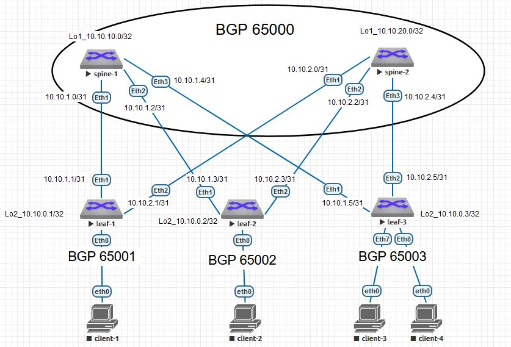

# Домашнее задание №4
### Настроить BGP для Underlay сети


### Схема сети


#
### Конфигурация оборудования

<details>
<summary>spine-1</summary>

[spine-1](Config/spine-1.conf)
```
hostname spine1
!
spanning-tree mode mstp
!
interface Ethernet1
   description leaf-1
   no switchport
   ip address 10.10.1.0/31
!
interface Ethernet2
   description leaf-2
   no switchport
   ip address 10.10.1.2/31
!
interface Ethernet3
   description leaf-3
   no switchport
   ip address 10.10.1.4/31
!
interface Loopback1
   ip address 10.10.10.0/32
!
interface Management1
!
ip routing
!
ip as-path access-list 10 permit ^$ any
!
ip prefix-list loop
   seq 10 permit 10.10.10.0/32
!
ip route 10.10.1.0/29 Null0
!
route-map loop permit 10
   match ip address prefix-list loop
!
peer-filter leaf
   10 match as-range 65001-65003 result accept
!
router bgp 65000
   router-id 10.10.10.0
   timers bgp 3 9
   maximum-paths 2
   bgp listen range 10.10.1.0/29 peer-group leaf peer-filter leaf
   neighbor leaf peer group
   neighbor leaf next-hop-self
   neighbor leaf bfd
   neighbor leaf password 7 i4EOoNLfwil9c106ZWb5fA==
   network 10.10.1.0/29
   redistribute connected route-map loop
!
end
```
</details>

<details>
<summary>spine-2</summary>

[spine-2](Config/spine-2.conf)
```
hostname spine-2
!
spanning-tree mode mstp
!
interface Ethernet1
   description leaf-1
   no switchport
   ip address 10.10.2.0/31
!
interface Ethernet2
   description leaf-2
   no switchport
   ip address 10.10.2.2/31
!
interface Ethernet3
   description leaf-3
   no switchport
   ip address 10.10.2.4/31
!
interface Loopback1
   ip address 10.10.20.0/32
!
interface Management1
!
ip routing
!
ip as-path access-list 10 permit ^$ any
!
ip prefix-list leaf-in
   seq 5 permit 10.0.0.0/8
!
ip prefix-list leaf-out
   seq 5 permit 10.10.2.0/29
!
ip prefix-list loop
   seq 10 permit 10.10.20.0/32
!
ip route 10.10.2.0/29 Null0
!
route-map loop permit 10
   match ip address prefix-list loop
!
router bgp 65000
   router-id 10.10.20.0
   timers bgp 3 9
   maximum-paths 2
   neighbor 10.10.2.1 remote-as 65001
   neighbor 10.10.2.1 bfd
   neighbor 10.10.2.1 route-map leaf-in in
   neighbor 10.10.2.1 route-map leaf-out out
   neighbor 10.10.2.1 password 7 bz6CP31/O2UqY00pK9TCHA==
   neighbor 10.10.2.3 remote-as 65002
   neighbor 10.10.2.3 bfd
   neighbor 10.10.2.3 route-map leaf-in in
   neighbor 10.10.2.3 route-map leaf-out out
   neighbor 10.10.2.3 password 7 ZSPSfHYyuPxNHlT3xizgcQ==
   neighbor 10.10.2.5 remote-as 65003
   neighbor 10.10.2.5 bfd
   neighbor 10.10.2.5 route-map leaf-in in
   neighbor 10.10.2.5 route-map leaf-out out
   neighbor 10.10.2.5 password 7 ykPvUehIyrSHgZzZXl2GSQ==
   network 10.10.2.0/29
   redistribute connected route-map loop
!
end
```
</details>

<details>
<summary>leaf-1</summary>

[leaf-1](Config/leaf-1.conf)
```
hostname leaf-1
!
spanning-tree mode mstp
!
interface Ethernet1
   description spine-1
   no switchport
   ip address 10.10.1.1/31
!
interface Ethernet2
   description spine-2
   no switchport
   ip address 10.10.2.1/31
!
interface Loopback2
   ip address 10.10.0.1/32
!
interface Management1
!
ip routing
!
ip prefix-list loop
   seq 10 permit 10.10.0.1/32
!
route-map loop permit 10
   match ip address prefix-list loop
!
router bgp 65001
   router-id 10.10.0.1
   timers bgp 3 9
   maximum-paths 2
   neighbor 10.10.1.0 remote-as 65000
   neighbor 10.10.1.0 bfd
   neighbor 10.10.1.0 password 7 7tvg/aRwIygTniCYSXUPEg==
   neighbor 10.10.2.0 remote-as 65000
   neighbor 10.10.2.0 bfd
   neighbor 10.10.2.0 password 7 bz6CP31/O2UqY00pK9TCHA==
   network 10.10.1.0/31
   network 10.10.2.0/31
   redistribute connected route-map loop
!
end
```
</details>

<details>
<summary>leaf-2</summary>

[leaf-2](Config/leaf-2.conf)
```
hostname leaf-2
!
spanning-tree mode mstp
!
interface Ethernet1
   description spine-1
   no switchport
   ip address 10.10.1.3/31
!
interface Ethernet2
   description spine-2
   no switchport
   ip address 10.10.2.3/31
!
interface Loopback2
   ip address 10.10.0.2/32
!
interface Management1
!
ip routing
!
ip prefix-list loop
   seq 10 permit 10.10.0.2/32
!
route-map loop permit 10
   match ip address prefix-list loop
!
router bgp 65002
   router-id 10.10.0.2
   maximum-paths 2
   neighbor 10.10.1.2 remote-as 65000
   neighbor 10.10.1.2 bfd
   neighbor 10.10.1.2 password 7 ANUhHTpBAeD3CbMkFHzCMQ==
   neighbor 10.10.2.2 remote-as 65000
   neighbor 10.10.2.2 bfd
   neighbor 10.10.2.2 password 7 ZSPSfHYyuPxNHlT3xizgcQ==
   network 10.10.1.2/31
   network 10.10.2.2/31
   redistribute connected route-map loop
!
end
```
</details>

<details>
<summary>leaf-3</summary>

[leaf-3](Config/leaf-3.conf)
```
hostname leaf-3
!
spanning-tree mode mstp
!
interface Ethernet1
   description spine-1
   no switchport
   ip address 10.10.1.5/31
!
interface Ethernet2
   description spine-2
   no switchport
   ip address 10.10.2.5/31
!
interface Loopback2
   ip address 10.10.0.3/32
!
interface Management1
!
ip routing
!
ip prefix-list loop
   seq 10 permit 10.10.0.3/32
!
route-map loop permit 10
   match ip address prefix-list loop
!
router bgp 65003
   router-id 10.10.0.3
   maximum-paths 2
   neighbor 10.10.1.4 remote-as 65000
   neighbor 10.10.1.4 bfd
   neighbor 10.10.1.4 password 7 kofiCbtE3TdA+mdiQdM2ag==
   neighbor 10.10.2.4 remote-as 65000
   neighbor 10.10.2.4 bfd
   neighbor 10.10.2.4 password 7 ykPvUehIyrSHgZzZXl2GSQ==
   network 10.10.1.4/31
   network 10.10.2.4/31
   redistribute connected route-map loop
!
end
```
</details>

#
### Проверка связности устройства по протоколу BGP
<details>
<summary>spine-1</summary>

- ### spine-1
```
spine1#sho ip bg summary
BGP summary information for VRF default
Router identifier 10.10.10.0, local AS number 65000
Neighbor Status Codes: m - Under maintenance
  Neighbor         V  AS           MsgRcvd   MsgSent  InQ OutQ  Up/Down State   PfxRcd PfxAcc
  10.10.1.1        4  65001            173       172    0    0 00:08:12 Estab   3      3
  10.10.1.3        4  65002            174       172    0    0 00:08:13 Estab   3      3
  10.10.1.5        4  65003            174       172    0    0 00:08:12 Estab   3      3

  spine1#sho ip ro
Gateway of last resort is not set
 B E      10.10.0.1/32 [200/0] via 10.10.1.1, Ethernet1
 B E      10.10.0.2/32 [200/0] via 10.10.1.3, Ethernet2
 B E      10.10.0.3/32 [200/0] via 10.10.1.5, Ethernet3
 C        10.10.1.0/31 is directly connected, Ethernet1
 C        10.10.1.2/31 is directly connected, Ethernet2
 C        10.10.1.4/31 is directly connected, Ethernet3
 S        10.10.1.0/29 is directly connected, Null0
 B E      10.10.2.0/31 [200/0] via 10.10.1.1, Ethernet1
 B E      10.10.2.2/31 [200/0] via 10.10.1.3, Ethernet2
 B E      10.10.2.4/31 [200/0] via 10.10.1.5, Ethernet3
 C        10.10.10.0/32 is directly connected, Loopback1


 spine1#sho ip ro bg
 B E      10.10.0.1/32 [200/0] via 10.10.1.1, Ethernet1
 B E      10.10.0.2/32 [200/0] via 10.10.1.3, Ethernet2
 B E      10.10.0.3/32 [200/0] via 10.10.1.5, Ethernet3
 B E      10.10.2.0/31 [200/0] via 10.10.1.1, Ethernet1
 B E      10.10.2.2/31 [200/0] via 10.10.1.3, Ethernet2
 B E      10.10.2.4/31 [200/0] via 10.10.1.5, Ethernet3


```
</details>

<details>
<summary>spine-2</summary>

- ### spine-2
```
spine-2#sho ip bg summary
BGP summary information for VRF default
Router identifier 10.10.20.0, local AS number 65000
Neighbor Status Codes: m - Under maintenance
  Neighbor         V  AS           MsgRcvd   MsgSent  InQ OutQ  Up/Down State   PfxRcd PfxAcc
  10.10.2.1        4  65001            348       348    0    0 00:16:28 Estab   3      3
  10.10.2.3        4  65002            347       347    0    0 00:16:28 Estab   3      3
  10.10.2.5        4  65003            347       347    0    0 00:16:28 Estab   3      3


spine-2#sho ip ro bg
 B E      10.10.0.1/32 [200/0] via 10.10.2.1, Ethernet1
 B E      10.10.0.2/32 [200/0] via 10.10.2.3, Ethernet2
 B E      10.10.0.3/32 [200/0] via 10.10.2.5, Ethernet3
 B E      10.10.1.0/31 [200/0] via 10.10.2.1, Ethernet1
 B E      10.10.1.2/31 [200/0] via 10.10.2.3, Ethernet2
 B E      10.10.1.4/31 [200/0] via 10.10.2.5, Ethernet3


spine-2#sho ip ro
Gateway of last resort is not set
 B E      10.10.0.1/32 [200/0] via 10.10.2.1, Ethernet1
 B E      10.10.0.2/32 [200/0] via 10.10.2.3, Ethernet2
 B E      10.10.0.3/32 [200/0] via 10.10.2.5, Ethernet3
 B E      10.10.1.0/31 [200/0] via 10.10.2.1, Ethernet1
 B E      10.10.1.2/31 [200/0] via 10.10.2.3, Ethernet2
 B E      10.10.1.4/31 [200/0] via 10.10.2.5, Ethernet3
 C        10.10.2.0/31 is directly connected, Ethernet1
 C        10.10.2.2/31 is directly connected, Ethernet2
 C        10.10.2.4/31 is directly connected, Ethernet3
 S        10.10.2.0/29 is directly connected, Null0
 C        10.10.20.0/32 is directly connected, Loopback1
```
</details>

<details>
<summary>leaf-1</summary>

- ### leaf-1
```
leaf-1#sho ip bg summary
BGP summary information for VRF default
Router identifier 10.10.0.1, local AS number 65001
Neighbor Status Codes: m - Under maintenance
  Neighbor         V  AS           MsgRcvd   MsgSent  InQ OutQ  Up/Down State   PfxRcd PfxAcc
  10.10.1.0        4  65000            393       397    0    0 00:18:38 Estab   6      6
  10.10.2.0        4  65000            389       393    0    0 00:18:37 Estab   6      6


leaf-1#sho ip ro bg
 B E      10.10.0.2/32 [200/0] via 10.10.1.0, Ethernet1
                               via 10.10.2.0, Ethernet2
 B E      10.10.0.3/32 [200/0] via 10.10.1.0, Ethernet1
                               via 10.10.2.0, Ethernet2
 B E      10.10.1.2/31 [200/0] via 10.10.2.0, Ethernet2
 B E      10.10.1.4/31 [200/0] via 10.10.2.0, Ethernet2
 B E      10.10.1.0/29 [200/0] via 10.10.1.0, Ethernet1
 B E      10.10.2.2/31 [200/0] via 10.10.1.0, Ethernet1
 B E      10.10.2.4/31 [200/0] via 10.10.1.0, Ethernet1
 B E      10.10.2.0/29 [200/0] via 10.10.2.0, Ethernet2
 B E      10.10.10.0/32 [200/0] via 10.10.1.0, Ethernet1
 B E      10.10.20.0/32 [200/0] via 10.10.2.0, Ethernet2


leaf-1#sho ip ro
 C        10.10.0.1/32 is directly connected, Loopback2
 B E      10.10.0.2/32 [200/0] via 10.10.1.0, Ethernet1
                               via 10.10.2.0, Ethernet2
 B E      10.10.0.3/32 [200/0] via 10.10.1.0, Ethernet1
                               via 10.10.2.0, Ethernet2
 C        10.10.1.0/31 is directly connected, Ethernet1
 B E      10.10.1.2/31 [200/0] via 10.10.2.0, Ethernet2
 B E      10.10.1.4/31 [200/0] via 10.10.2.0, Ethernet2
 B E      10.10.1.0/29 [200/0] via 10.10.1.0, Ethernet1
 C        10.10.2.0/31 is directly connected, Ethernet2
 B E      10.10.2.2/31 [200/0] via 10.10.1.0, Ethernet1
 B E      10.10.2.4/31 [200/0] via 10.10.1.0, Ethernet1
 B E      10.10.2.0/29 [200/0] via 10.10.2.0, Ethernet2
 B E      10.10.10.0/32 [200/0] via 10.10.1.0, Ethernet1
 B E      10.10.20.0/32 [200/0] via 10.10.2.0, Ethernet2
```
</details>

<details>
<summary>leaf-2</summary>

- ### leaf-2
```
leaf-2#sho ip bg summary
BGP summary information for VRF default
Router identifier 10.10.0.2, local AS number 65002
Neighbor Status Codes: m - Under maintenance
  Neighbor         V  AS           MsgRcvd   MsgSent  InQ OutQ  Up/Down State   PfxRcd PfxAcc
  10.10.1.2        4  65000            727       732    0    0 00:35:31 Estab   6      6
  10.10.2.2        4  65000            726       730    0    0 00:35:31 Estab   6      6


leaf-2#sho ip ro bg
 B E      10.10.0.1/32 [200/0] via 10.10.1.2, Ethernet1
                               via 10.10.2.2, Ethernet2
 B E      10.10.0.3/32 [200/0] via 10.10.1.2, Ethernet1
                               via 10.10.2.2, Ethernet2
 B E      10.10.1.0/31 [200/0] via 10.10.2.2, Ethernet2
 B E      10.10.1.4/31 [200/0] via 10.10.2.2, Ethernet2
 B E      10.10.1.0/29 [200/0] via 10.10.1.2, Ethernet1
 B E      10.10.2.0/31 [200/0] via 10.10.1.2, Ethernet1
 B E      10.10.2.4/31 [200/0] via 10.10.1.2, Ethernet1
 B E      10.10.2.0/29 [200/0] via 10.10.2.2, Ethernet2
 B E      10.10.10.0/32 [200/0] via 10.10.1.2, Ethernet1
 B E      10.10.20.0/32 [200/0] via 10.10.2.2, Ethernet2


leaf-2#sho ip ro
 B E      10.10.0.1/32 [200/0] via 10.10.1.2, Ethernet1
                               via 10.10.2.2, Ethernet2
 C        10.10.0.2/32 is directly connected, Loopback2
 B E      10.10.0.3/32 [200/0] via 10.10.1.2, Ethernet1
                               via 10.10.2.2, Ethernet2
 B E      10.10.1.0/31 [200/0] via 10.10.2.2, Ethernet2
 C        10.10.1.2/31 is directly connected, Ethernet1
 B E      10.10.1.4/31 [200/0] via 10.10.2.2, Ethernet2
 B E      10.10.1.0/29 [200/0] via 10.10.1.2, Ethernet1
 B E      10.10.2.0/31 [200/0] via 10.10.1.2, Ethernet1
 C        10.10.2.2/31 is directly connected, Ethernet2
 B E      10.10.2.4/31 [200/0] via 10.10.1.2, Ethernet1
 B E      10.10.2.0/29 [200/0] via 10.10.2.2, Ethernet2
 B E      10.10.10.0/32 [200/0] via 10.10.1.2, Ethernet1
 B E      10.10.20.0/32 [200/0] via 10.10.2.2, Ethernet2
```
</details>

<details>
<summary>leaf-3</summary>

- ### leaf-3
```
leaf-3#sho ip bg summary
BGP summary information for VRF default
Router identifier 10.10.0.3, local AS number 65003
Neighbor Status Codes: m - Under maintenance
  Neighbor         V  AS           MsgRcvd   MsgSent  InQ OutQ  Up/Down State   PfxRcd PfxAcc
  10.10.1.4        4  65000            769       774    0    0 00:37:33 Estab   6      6
  10.10.2.4        4  65000            767       771    0    0 00:37:34 Estab   6      6


leaf-3#sho ip ro bg
 B E      10.10.0.1/32 [200/0] via 10.10.1.4, Ethernet1
                               via 10.10.2.4, Ethernet2
 B E      10.10.0.2/32 [200/0] via 10.10.1.4, Ethernet1
                               via 10.10.2.4, Ethernet2
 B E      10.10.1.0/31 [200/0] via 10.10.2.4, Ethernet2
 B E      10.10.1.2/31 [200/0] via 10.10.2.4, Ethernet2
 B E      10.10.1.0/29 [200/0] via 10.10.1.4, Ethernet1
 B E      10.10.2.0/31 [200/0] via 10.10.1.4, Ethernet1
 B E      10.10.2.2/31 [200/0] via 10.10.1.4, Ethernet1
 B E      10.10.2.0/29 [200/0] via 10.10.2.4, Ethernet2
 B E      10.10.10.0/32 [200/0] via 10.10.1.4, Ethernet1
 B E      10.10.20.0/32 [200/0] via 10.10.2.4, Ethernet2


leaf-3#sho ip route
 B E      10.10.0.1/32 [200/0] via 10.10.1.4, Ethernet1
                               via 10.10.2.4, Ethernet2
 B E      10.10.0.2/32 [200/0] via 10.10.1.4, Ethernet1
                               via 10.10.2.4, Ethernet2
 C        10.10.0.3/32 is directly connected, Loopback2
 B E      10.10.1.0/31 [200/0] via 10.10.2.4, Ethernet2
 B E      10.10.1.2/31 [200/0] via 10.10.2.4, Ethernet2
 C        10.10.1.4/31 is directly connected, Ethernet1
 B E      10.10.1.0/29 [200/0] via 10.10.1.4, Ethernet1
 B E      10.10.2.0/31 [200/0] via 10.10.1.4, Ethernet1
 B E      10.10.2.2/31 [200/0] via 10.10.1.4, Ethernet1
 C        10.10.2.4/31 is directly connected, Ethernet2
 B E      10.10.2.0/29 [200/0] via 10.10.2.4, Ethernet2
 B E      10.10.10.0/32 [200/0] via 10.10.1.4, Ethernet1
 B E      10.10.20.0/32 [200/0] via 10.10.2.4, Ethernet2
```
</details>

#
### Связность по ping

<details>
<summary>spine-1</summary>

- #### spine-1
```
spine1#ping 10.10.0.1
PING 10.10.0.1 (10.10.0.1) 72(100) bytes of data.
80 bytes from 10.10.0.1: icmp_seq=1 ttl=64 time=6.20 ms
80 bytes from 10.10.0.1: icmp_seq=2 ttl=64 time=2.57 ms
80 bytes from 10.10.0.1: icmp_seq=3 ttl=64 time=2.75 ms
80 bytes from 10.10.0.1: icmp_seq=4 ttl=64 time=2.66 ms
80 bytes from 10.10.0.1: icmp_seq=5 ttl=64 time=3.15 ms
--- 10.10.0.1 ping statistics ---
5 packets transmitted, 5 received, 0% packet loss, time 24ms
rtt min/avg/max/mdev = 2.579/3.471/6.201/1.379 ms, ipg/ewma 6.043/4.800 ms

spine1#ping 10.10.0.2
PING 10.10.0.2 (10.10.0.2) 72(100) bytes of data.
80 bytes from 10.10.0.2: icmp_seq=1 ttl=64 time=5.39 ms
80 bytes from 10.10.0.2: icmp_seq=2 ttl=64 time=4.75 ms
80 bytes from 10.10.0.2: icmp_seq=3 ttl=64 time=2.65 ms
80 bytes from 10.10.0.2: icmp_seq=4 ttl=64 time=2.59 ms
80 bytes from 10.10.0.2: icmp_seq=5 ttl=64 time=2.34 ms
--- 10.10.0.2 ping statistics ---
5 packets transmitted, 5 received, 0% packet loss, time 24ms
rtt min/avg/max/mdev = 2.347/3.547/5.390/1.265 ms, ipg/ewma 6.028/4.388 ms

spine1#ping 10.10.0.3
PING 10.10.0.3 (10.10.0.3) 72(100) bytes of data.
80 bytes from 10.10.0.3: icmp_seq=1 ttl=64 time=4.35 ms
80 bytes from 10.10.0.3: icmp_seq=2 ttl=64 time=2.30 ms
80 bytes from 10.10.0.3: icmp_seq=3 ttl=64 time=2.34 ms
80 bytes from 10.10.0.3: icmp_seq=4 ttl=64 time=2.92 ms
80 bytes from 10.10.0.3: icmp_seq=5 ttl=64 time=2.35 ms
--- 10.10.0.3 ping statistics ---
5 packets transmitted, 5 received, 0% packet loss, time 20ms
rtt min/avg/max/mdev = 2.306/2.856/4.355/0.784 ms, ipg/ewma 5.000/3.584 ms

spine1#ping 10.10.2.0
PING 10.10.2.0 (10.10.2.0) 72(100) bytes of data.
80 bytes from 10.10.2.0: icmp_seq=1 ttl=63 time=8.06 ms
80 bytes from 10.10.2.0: icmp_seq=2 ttl=63 time=4.51 ms
80 bytes from 10.10.2.0: icmp_seq=3 ttl=63 time=4.90 ms
80 bytes from 10.10.2.0: icmp_seq=4 ttl=63 time=4.96 ms
80 bytes from 10.10.2.0: icmp_seq=5 ttl=63 time=6.81 ms

--- 10.10.2.0 ping statistics ---
5 packets transmitted, 5 received, 0% packet loss, time 31ms
rtt min/avg/max/mdev = 4.519/5.853/8.061/1.363 ms, ipg/ewma 7.958/6.968 ms
```
</details>

<details>
<summary>spine-2</summary>

- #### spine-2
```
spine-2#ping 10.10.0.3
PING 10.10.0.3 (10.10.0.3) 72(100) bytes of data.
80 bytes from 10.10.0.3: icmp_seq=1 ttl=64 time=4.40 ms
80 bytes from 10.10.0.3: icmp_seq=2 ttl=64 time=2.60 ms
80 bytes from 10.10.0.3: icmp_seq=3 ttl=64 time=3.05 ms
80 bytes from 10.10.0.3: icmp_seq=4 ttl=64 time=3.31 ms
--- 10.10.0.3 ping statistics ---
5 packets transmitted, 4 received, 20% packet loss, time 31ms
rtt min/avg/max/mdev = 2.606/3.346/4.402/0.661 ms, ipg/ewma 7.969/3.947 ms

spine-2#ping 10.10.0.2
PING 10.10.0.2 (10.10.0.2) 72(100) bytes of data.
80 bytes from 10.10.0.2: icmp_seq=1 ttl=64 time=4.94 ms
80 bytes from 10.10.0.2: icmp_seq=2 ttl=64 time=2.26 ms
80 bytes from 10.10.0.2: icmp_seq=3 ttl=64 time=2.32 ms
80 bytes from 10.10.0.2: icmp_seq=4 ttl=64 time=1.97 ms
80 bytes from 10.10.0.2: icmp_seq=5 ttl=64 time=2.20 ms
--- 10.10.0.2 ping statistics ---
5 packets transmitted, 5 received, 0% packet loss, time 20ms
rtt min/avg/max/mdev = 1.975/2.742/4.942/1.106 ms, ipg/ewma 5.162/3.800 ms

spine-2#ping 10.10.0.1
PING 10.10.0.1 (10.10.0.1) 72(100) bytes of data.
80 bytes from 10.10.0.1: icmp_seq=1 ttl=64 time=3.97 ms
80 bytes from 10.10.0.1: icmp_seq=2 ttl=64 time=2.95 ms
80 bytes from 10.10.0.1: icmp_seq=3 ttl=64 time=2.23 ms
80 bytes from 10.10.0.1: icmp_seq=4 ttl=64 time=2.46 ms
80 bytes from 10.10.0.1: icmp_seq=5 ttl=64 time=2.21 ms
--- 10.10.0.1 ping statistics ---
5 packets transmitted, 5 received, 0% packet loss, time 20ms
rtt min/avg/max/mdev = 2.214/2.769/3.978/0.661 ms, ipg/ewma 5.003/3.339 ms

spine-2#ping 10.10.1.4
PING 10.10.1.4 (10.10.1.4) 72(100) bytes of data.
80 bytes from 10.10.1.4: icmp_seq=1 ttl=63 time=8.54 ms
80 bytes from 10.10.1.4: icmp_seq=2 ttl=63 time=5.10 ms
80 bytes from 10.10.1.4: icmp_seq=3 ttl=63 time=4.95 ms
80 bytes from 10.10.1.4: icmp_seq=4 ttl=63 time=4.97 ms
80 bytes from 10.10.1.4: icmp_seq=5 ttl=63 time=4.89 ms

--- 10.10.1.4 ping statistics ---
5 packets transmitted, 5 received, 0% packet loss, time 36ms
rtt min/avg/max/mdev = 4.894/5.691/8.540/1.428 ms, ipg/ewma 9.098/7.062 ms
```
</details>

<details>
<summary>leaf-1</summary>

- ### leaf-1
```
leaf-1#ping 10.10.10.0
PING 10.10.10.0 (10.10.10.0) 72(100) bytes of data.
80 bytes from 10.10.10.0: icmp_seq=1 ttl=64 time=4.04 ms
80 bytes from 10.10.10.0: icmp_seq=2 ttl=64 time=2.37 ms
80 bytes from 10.10.10.0: icmp_seq=3 ttl=64 time=2.53 ms
80 bytes from 10.10.10.0: icmp_seq=4 ttl=64 time=2.17 ms
80 bytes from 10.10.10.0: icmp_seq=5 ttl=64 time=2.12 ms
--- 10.10.10.0 ping statistics ---
5 packets transmitted, 5 received, 0% packet loss, time 19ms
rtt min/avg/max/mdev = 2.128/2.649/4.043/0.711 ms, ipg/ewma 4.826/3.314 ms

leaf-1#ping 10.10.20.0
PING 10.10.20.0 (10.10.20.0) 72(100) bytes of data.
80 bytes from 10.10.20.0: icmp_seq=1 ttl=64 time=3.75 ms
80 bytes from 10.10.20.0: icmp_seq=2 ttl=64 time=2.21 ms
80 bytes from 10.10.20.0: icmp_seq=3 ttl=64 time=2.58 ms
80 bytes from 10.10.20.0: icmp_seq=4 ttl=64 time=2.38 ms
80 bytes from 10.10.20.0: icmp_seq=5 ttl=64 time=2.02 ms
--- 10.10.20.0 ping statistics ---
5 packets transmitted, 5 received, 0% packet loss, time 18ms
rtt min/avg/max/mdev = 2.021/2.590/3.751/0.612 ms, ipg/ewma 4.667/3.145 ms

leaf-1#ping 10.10.0.1
PING 10.10.0.1 (10.10.0.1) 72(100) bytes of data.
80 bytes from 10.10.0.1: icmp_seq=1 ttl=64 time=0.659 ms
80 bytes from 10.10.0.1: icmp_seq=2 ttl=64 time=0.037 ms
80 bytes from 10.10.0.1: icmp_seq=3 ttl=64 time=0.038 ms
80 bytes from 10.10.0.1: icmp_seq=4 ttl=64 time=0.015 ms
80 bytes from 10.10.0.1: icmp_seq=5 ttl=64 time=0.011 ms
--- 10.10.0.1 ping statistics ---
5 packets transmitted, 5 received, 0% packet loss, time 9ms
rtt min/avg/max/mdev = 0.011/0.152/0.659/0.253 ms, ipg/ewma 2.483/0.396 ms

leaf-1#ping 10.10.0.3
PING 10.10.0.3 (10.10.0.3) 72(100) bytes of data.
80 bytes from 10.10.0.3: icmp_seq=1 ttl=63 time=7.76 ms
80 bytes from 10.10.0.3: icmp_seq=2 ttl=63 time=5.47 ms
80 bytes from 10.10.0.3: icmp_seq=3 ttl=63 time=5.16 ms
80 bytes from 10.10.0.3: icmp_seq=4 ttl=63 time=5.54 ms
80 bytes from 10.10.0.3: icmp_seq=5 ttl=63 time=5.06 ms

--- 10.10.0.3 ping statistics ---
5 packets transmitted, 5 received, 0% packet loss, time 33ms
rtt min/avg/max/mdev = 5.060/5.804/7.765/0.997 ms, ipg/ewma 8.285/6.744 ms
```
</details>

<details>
<summary>leaf-2</summary>

- ### leaf-2
```
leaf-2#ping 10.10.10.0
PING 10.10.10.0 (10.10.10.0) 72(100) bytes of data.
80 bytes from 10.10.10.0: icmp_seq=1 ttl=64 time=5.36 ms
80 bytes from 10.10.10.0: icmp_seq=2 ttl=64 time=2.18 ms
80 bytes from 10.10.10.0: icmp_seq=3 ttl=64 time=2.53 ms
80 bytes from 10.10.10.0: icmp_seq=4 ttl=64 time=2.50 ms
80 bytes from 10.10.10.0: icmp_seq=5 ttl=64 time=2.39 ms
--- 10.10.10.0 ping statistics ---
5 packets transmitted, 5 received, 0% packet loss, time 21ms
rtt min/avg/max/mdev = 2.181/2.998/5.369/1.192 ms, ipg/ewma 5.446/4.146 ms

leaf-2#ping 10.10.0.1
PING 10.10.0.1 (10.10.0.1) 72(100) bytes of data.
80 bytes from 10.10.0.1: icmp_seq=1 ttl=63 time=7.08 ms
80 bytes from 10.10.0.1: icmp_seq=2 ttl=63 time=5.18 ms
80 bytes from 10.10.0.1: icmp_seq=3 ttl=63 time=5.15 ms
80 bytes from 10.10.0.1: icmp_seq=4 ttl=63 time=5.57 ms
80 bytes from 10.10.0.1: icmp_seq=5 ttl=63 time=4.85 ms
--- 10.10.0.1 ping statistics ---
5 packets transmitted, 5 received, 0% packet loss, time 30ms
rtt min/avg/max/mdev = 4.850/5.569/7.089/0.795 ms, ipg/ewma 7.694/6.298 ms

leaf-2#ping 10.10.0.3
PING 10.10.0.3 (10.10.0.3) 72(100) bytes of data.
80 bytes from 10.10.0.3: icmp_seq=1 ttl=63 time=6.73 ms
80 bytes from 10.10.0.3: icmp_seq=2 ttl=63 time=5.45 ms
80 bytes from 10.10.0.3: icmp_seq=3 ttl=63 time=5.16 ms
80 bytes from 10.10.0.3: icmp_seq=4 ttl=63 time=6.00 ms
80 bytes from 10.10.0.3: icmp_seq=5 ttl=63 time=5.83 ms
--- 10.10.0.3 ping statistics ---
5 packets transmitted, 5 received, 0% packet loss, time 31ms
rtt min/avg/max/mdev = 5.164/5.838/6.738/0.541 ms, ipg/ewma 7.920/6.286 ms

leaf-2#ping 10.10.20.0
PING 10.10.20.0 (10.10.20.0) 72(100) bytes of data.
80 bytes from 10.10.20.0: icmp_seq=1 ttl=64 time=3.74 ms
80 bytes from 10.10.20.0: icmp_seq=2 ttl=64 time=2.26 ms
80 bytes from 10.10.20.0: icmp_seq=3 ttl=64 time=2.96 ms
80 bytes from 10.10.20.0: icmp_seq=4 ttl=64 time=2.34 ms
80 bytes from 10.10.20.0: icmp_seq=5 ttl=64 time=2.52 ms

--- 10.10.20.0 ping statistics ---
5 packets transmitted, 5 received, 0% packet loss, time 20ms
rtt min/avg/max/mdev = 2.266/2.767/3.744/0.547 ms, ipg/ewma 5.003/3.239 ms
```
</details>

<details>
<summary>leaf-3</summary>

- ### leaf-3
```
leaf-3#ping 10.10.10.0
PING 10.10.10.0 (10.10.10.0) 72(100) bytes of data.
80 bytes from 10.10.10.0: icmp_seq=1 ttl=64 time=4.14 ms
80 bytes from 10.10.10.0: icmp_seq=2 ttl=64 time=2.65 ms
80 bytes from 10.10.10.0: icmp_seq=3 ttl=64 time=2.34 ms
80 bytes from 10.10.10.0: icmp_seq=4 ttl=64 time=2.23 ms
--- 10.10.10.0 ping statistics ---
5 packets transmitted, 4 received, 20% packet loss, time 20ms
rtt min/avg/max/mdev = 2.237/2.846/4.146/0.767 ms, ipg/ewma 5.048/3.568 ms

leaf-3#ping 10.10.20.0
PING 10.10.20.0 (10.10.20.0) 72(100) bytes of data.
80 bytes from 10.10.20.0: icmp_seq=1 ttl=64 time=4.66 ms
80 bytes from 10.10.20.0: icmp_seq=2 ttl=64 time=2.28 ms
80 bytes from 10.10.20.0: icmp_seq=3 ttl=64 time=2.16 ms
80 bytes from 10.10.20.0: icmp_seq=4 ttl=64 time=2.59 ms
80 bytes from 10.10.20.0: icmp_seq=5 ttl=64 time=2.55 ms
--- 10.10.20.0 ping statistics ---
5 packets transmitted, 5 received, 0% packet loss, time 19ms
rtt min/avg/max/mdev = 2.169/2.853/4.666/0.922 ms, ipg/ewma 4.805/3.737 ms

leaf-3#ping 10.10.0.1
PING 10.10.0.1 (10.10.0.1) 72(100) bytes of data.
80 bytes from 10.10.0.1: icmp_seq=1 ttl=63 time=6.79 ms
80 bytes from 10.10.0.1: icmp_seq=2 ttl=63 time=5.34 ms
80 bytes from 10.10.0.1: icmp_seq=3 ttl=63 time=5.23 ms
80 bytes from 10.10.0.1: icmp_seq=4 ttl=63 time=5.46 ms
80 bytes from 10.10.0.1: icmp_seq=5 ttl=63 time=5.56 ms
--- 10.10.0.1 ping statistics ---
5 packets transmitted, 5 received, 0% packet loss, time 31ms
rtt min/avg/max/mdev = 5.237/5.680/6.794/0.575 ms, ipg/ewma 7.831/6.224 ms

leaf-3#ping 10.10.0.2
PING 10.10.0.2 (10.10.0.2) 72(100) bytes of data.
80 bytes from 10.10.0.2: icmp_seq=1 ttl=63 time=7.61 ms
80 bytes from 10.10.0.2: icmp_seq=2 ttl=63 time=5.20 ms
80 bytes from 10.10.0.2: icmp_seq=3 ttl=63 time=6.87 ms
80 bytes from 10.10.0.2: icmp_seq=4 ttl=63 time=5.30 ms
80 bytes from 10.10.0.2: icmp_seq=5 ttl=63 time=6.86 ms

--- 10.10.0.2 ping statistics ---
5 packets transmitted, 5 received, 0% packet loss, time 32ms
rtt min/avg/max/mdev = 5.206/6.372/7.616/0.954 ms, ipg/ewma 8.153/6.996 ms
```
</details>

#