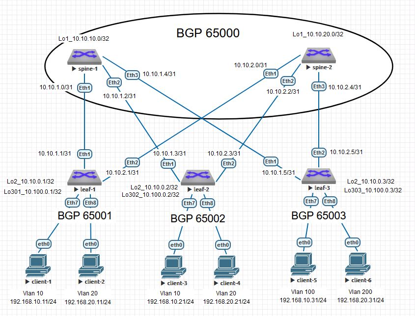

# Домашнее задание №5
### Overlay на основе VxLAN EVPN для L2


### Схема сети




#
### Конфигурация оборудования

<details>
<summary>spine-1</summary>

[spine-1](Config/spine-1.conf)
```
service routing protocols model multi-agent
!
hostname spine1
!
spanning-tree mode mstp
!
interface Ethernet1
   description leaf-1
   no switchport
   ip address 10.10.1.0/31
!
interface Ethernet2
   description leaf-2
   no switchport
   ip address 10.10.1.2/31
!
interface Ethernet3
   description leaf-3
   no switchport
   ip address 10.10.1.4/31
!
interface Loopback1
   ip address 10.10.10.0/32
!
interface Management1
!
ip routing
!
ip as-path access-list 10 permit ^$ any
!
ip prefix-list loop
   seq 10 permit 10.10.10.0/32
!
route-map loop permit 10
   match ip address prefix-list loop
!
peer-filter EVPN
   10 match as-range 65001-65003 result accept
!
peer-filter leaf
   10 match as-range 65001-65003 result accept
!
router bgp 65000
   router-id 10.10.10.0
   timers bgp 3 9
   maximum-paths 2
   bgp listen range 10.10.0.0/24 peer-group EVPN peer-filter EVPN
   bgp listen range 10.10.1.0/29 peer-group leaf peer-filter leaf
   neighbor EVPN peer group
   neighbor EVPN next-hop-unchanged
   neighbor EVPN update-source Loopback1
   neighbor EVPN ebgp-multihop 3
   neighbor EVPN password 7 fEJ4wiPVReC6Jv2IoU6ayg==
   neighbor EVPN send-community extended
   neighbor leaf peer group
   neighbor leaf next-hop-self
   neighbor leaf bfd
   neighbor leaf password 7 i4EOoNLfwil9c106ZWb5fA==
   redistribute connected route-map loop
   !
   address-family evpn
      neighbor EVPN activate
   !
   address-family ipv4
      neighbor leaf activate
!
end
```
</details>


<details>
<summary>spine-2</summary>

[spine-2](Config/spine-2.conf)

```
service routing protocols model multi-agent
!
hostname spine-2
!
spanning-tree mode mstp
!
interface Ethernet1
   description leaf-1
   no switchport
   ip address 10.10.2.0/31
!
interface Ethernet2
   description leaf-2
   no switchport
   ip address 10.10.2.2/31
!
interface Ethernet3
   description leaf-3
   no switchport
   ip address 10.10.2.4/31
!
interface Loopback1
   ip address 10.10.20.0/32
!
interface Management1
!
ip routing
!
ip as-path access-list 10 permit ^$ any
!
ip prefix-list loop
   seq 10 permit 10.10.20.0/32
!
route-map loop permit 10
   match ip address prefix-list loop
!
peer-filter EVPN
   10 match as-range 65001-65003 result accept
!
router bgp 65000
   router-id 10.10.20.0
   timers bgp 3 9
   maximum-paths 2
   bgp listen range 10.10.0.0/24 peer-group EVPN peer-filter EVPN
   neighbor EVPN peer group
   neighbor EVPN next-hop-unchanged
   neighbor EVPN update-source Loopback1
   neighbor EVPN ebgp-multihop 3
   neighbor EVPN password 7 fEJ4wiPVReC6Jv2IoU6ayg==
   neighbor EVPN send-community extended
   neighbor 10.10.2.1 remote-as 65001
   neighbor 10.10.2.1 bfd
   neighbor 10.10.2.1 password 7 bz6CP31/O2UqY00pK9TCHA==
   neighbor 10.10.2.3 remote-as 65002
   neighbor 10.10.2.3 bfd
   neighbor 10.10.2.3 password 7 ZSPSfHYyuPxNHlT3xizgcQ==
   neighbor 10.10.2.5 remote-as 65003
   neighbor 10.10.2.5 bfd
   neighbor 10.10.2.5 password 7 ykPvUehIyrSHgZzZXl2GSQ==
   redistribute connected route-map loop
   !
   address-family evpn
      neighbor EVPN activate
   !
   address-family ipv4
      network 10.10.2.0/29
!
end
```
</details>


<details>
<summary>leaf-1</summary>

[leaf-1](Config/leaf-1.conf)
```
service routing protocols model multi-agent
!
hostname leaf-1
!
spanning-tree mode mstp
!
vlan 10
   name Client_1
!
vlan 20
   name Client_2
!
interface Ethernet1
   description spine-1
   no switchport
   ip address 10.10.1.1/31
!
interface Ethernet2
   description spine-2
   no switchport
   ip address 10.10.2.1/31
!
interface Ethernet7
   description Client_1
   switchport access vlan 10
!
interface Ethernet8
   description Client_2
   switchport access vlan 20
!
interface Loopback2
   ip address 10.10.0.1/32
!
interface Loopback301
   description NVE
   ip address 10.100.0.1/32
!
interface Management1
!
interface Vxlan1
   vxlan source-interface Loopback301
   vxlan udp-port 4789
   vxlan vlan 10 vni 10010
   vxlan vlan 20 vni 10020
   vxlan learn-restrict any
!
ip routing
!
ip prefix-list loop
   seq 10 permit 10.10.0.1/32
   seq 20 permit 10.100.0.1/32
!
route-map loop permit 10
   match ip address prefix-list loop
!
router bgp 65001
   router-id 10.10.0.1
   timers bgp 3 9
   maximum-paths 2
   neighbor EVPN peer group
   neighbor EVPN remote-as 65000
   neighbor EVPN update-source Loopback2
   neighbor EVPN ebgp-multihop 3
   neighbor EVPN password 7 fEJ4wiPVReC6Jv2IoU6ayg==
   neighbor EVPN send-community extended
   neighbor 10.10.1.0 remote-as 65000
   neighbor 10.10.1.0 bfd
   neighbor 10.10.1.0 password 7 7tvg/aRwIygTniCYSXUPEg==
   neighbor 10.10.2.0 remote-as 65000
   neighbor 10.10.2.0 bfd
   neighbor 10.10.2.0 password 7 bz6CP31/O2UqY00pK9TCHA==
   neighbor 10.10.10.0 peer group EVPN
   neighbor 10.10.20.0 peer group EVPN
   redistribute connected route-map loop
   !
   vlan 10
      rd 65001:10010
      route-target both 10:10010
      redistribute learned
   !
   vlan 20
      rd 65001:10020
      route-target both 20:10020
      redistribute learned
   !
   address-family evpn
      neighbor EVPN activate
   !
   address-family ipv4
      network 10.10.1.0/31
      network 10.10.2.0/31
!
end
```
</details>

<details>
<summary>leaf-2</summary>

[leaf-2](Config/leaf-2.conf)
```
service routing protocols model multi-agent
!
hostname leaf-2
!
spanning-tree mode mstp
!
vlan 10,20
   name Client
!
interface Ethernet1
   description spine-1
   no switchport
   ip address 10.10.1.3/31
!
interface Ethernet2
   description spine-2
   no switchport
   ip address 10.10.2.3/31
!
interface Ethernet7
   description Client_3
   switchport access vlan 10
!
interface Ethernet8
   description Client_4
   switchport access vlan 20
!
interface Loopback2
   ip address 10.10.0.2/32
!
interface Loopback302
   description NVE
   ip address 10.100.0.2/32
!
interface Management1
!
interface Vxlan1
   description VX
   vxlan source-interface Loopback302
   vxlan udp-port 4789
   vxlan vlan 10 vni 10010
   vxlan vlan 20 vni 10020
   vxlan learn-restrict any
!
ip routing
!
ip prefix-list loop
   seq 10 permit 10.10.0.2/32
   seq 20 permit 10.100.0.2/32
!
route-map loop permit 10
   match ip address prefix-list loop
!
router bgp 65002
   router-id 10.10.0.2
   maximum-paths 2
   neighbor EVPN peer group
   neighbor EVPN remote-as 65000
   neighbor EVPN update-source Loopback2
   neighbor EVPN ebgp-multihop 3
   neighbor EVPN password 7 fEJ4wiPVReC6Jv2IoU6ayg==
   neighbor EVPN send-community extended
   neighbor 10.10.1.2 remote-as 65000
   neighbor 10.10.1.2 bfd
   neighbor 10.10.1.2 password 7 ANUhHTpBAeD3CbMkFHzCMQ==
   neighbor 10.10.2.2 remote-as 65000
   neighbor 10.10.2.2 bfd
   neighbor 10.10.2.2 password 7 ZSPSfHYyuPxNHlT3xizgcQ==
   neighbor 10.10.10.0 peer group EVPN
   neighbor 10.10.20.0 peer group EVPN
   redistribute connected route-map loop
   !
   vlan 10
      rd 65002:10010
      route-target both 10:10010
      redistribute learned
   !
   vlan 20
      rd 65002:10020
      route-target both 20:10020
      redistribute learned
   !
   address-family evpn
      neighbor EVPN activate
   !
   address-family ipv4
      network 10.10.1.2/31
      network 10.10.2.2/31
!
end
```
</details>
<details>
<summary>leaf-3</summary>

[leaf-3](Config/leaf-3.conf)
```
service routing protocols model multi-agent
!
hostname leaf-3
!
spanning-tree mode mstp
!
vlan 10,20
   name Client
!
vlan 100,200
!
interface Ethernet1
   description spine-1
   no switchport
   ip address 10.10.1.5/31
!
interface Ethernet2
   description spine-2
   no switchport
   ip address 10.10.2.5/31
!
interface Ethernet7
   description Client_5
   switchport access vlan 100
!
interface Ethernet8
   description Client_6
   switchport access vlan 200
!
interface Loopback2
   ip address 10.10.0.3/32
!
interface Loopback303
   description NVE
   ip address 10.100.0.3/32
!
interface Management1
!
interface Vxlan1
   vxlan source-interface Loopback303
   vxlan udp-port 4789
   vxlan vlan 100 vni 10010
   vxlan vlan 200 vni 10020
   vxlan learn-restrict any
!
ip routing
!
ip prefix-list loop
   seq 10 permit 10.10.0.3/32
   seq 20 permit 10.100.0.3/32
!
route-map loop permit 10
   match ip address prefix-list loop
!
router bgp 65003
   router-id 10.10.0.3
   maximum-paths 2
   neighbor EVPN peer group
   neighbor EVPN remote-as 65000
   neighbor EVPN update-source Loopback2
   neighbor EVPN ebgp-multihop 3
   neighbor EVPN password 7 fEJ4wiPVReC6Jv2IoU6ayg==
   neighbor EVPN send-community extended
   neighbor 10.10.1.4 remote-as 65000
   neighbor 10.10.1.4 bfd
   neighbor 10.10.1.4 password 7 kofiCbtE3TdA+mdiQdM2ag==
   neighbor 10.10.2.4 remote-as 65000
   neighbor 10.10.2.4 bfd
   neighbor 10.10.2.4 password 7 ykPvUehIyrSHgZzZXl2GSQ==
   neighbor 10.10.10.0 peer group EVPN
   neighbor 10.10.20.0 peer group EVPN
   redistribute connected route-map loop
   !
   vlan 100
      rd 65003:10010
      route-target both 10:10010
      redistribute learned
   !
   vlan 200
      rd 65003:10020
      route-target both 20:10020
      redistribute learned
   !
   address-family evpn
      neighbor EVPN activate
   !
   address-family ipv4
      network 10.10.1.4/31
      network 10.10.2.4/31
!
end
```
</details>


#
### Проверка связанности клиентов по L2
<details>
<summary>spine-1</summary>

- ### spine-1
```
spine1#sho bgp evpn summary
BGP summary information for VRF default
Router identifier 10.10.10.0, local AS number 65000
Neighbor Status Codes: m - Under maintenance
  Neighbor  V AS           MsgRcvd   MsgSent  InQ OutQ  Up/Down State   PfxRcd PfxAcc
  10.10.0.1 4 65001           1913      1901    0    0 01:20:14 Estab   2      2
  10.10.0.2 4 65002           1912      1915    0    0 01:20:17 Estab   2      2
  10.10.0.3 4 65003           1915      1907    0    0 01:20:15 Estab   2      2

```
</details>

<details>
<summary>spine-2</summary>

- ### spine-2
```
spine-2#sho bgp evpn summary
BGP summary information for VRF default
Router identifier 10.10.20.0, local AS number 65000
Neighbor Status Codes: m - Under maintenance
  Neighbor  V AS           MsgRcvd   MsgSent  InQ OutQ  Up/Down State   PfxRcd PfxAcc
  10.10.0.1 4 65001           1977      1974    0    0 01:22:42 Estab   2      2
  10.10.0.2 4 65002           1952      1953    0    0 01:21:53 Estab   2      2
  10.10.0.3 4 65003           1947      1938    0    0 01:21:35 Estab   2      2
  ```
  </details>


  <details>
<summary>leaf-1</summary>

- ### leaf-1
```
leaf-1#sh ip bgp summary
BGP summary information for VRF default
Router identifier 10.10.0.1, local AS number 65001
Neighbor Status Codes: m - Under maintenance
  Neighbor   V AS           MsgRcvd   MsgSent  InQ OutQ  Up/Down State   PfxRcd PfxAcc
  10.10.1.0  4 65000            402       412    0    0 00:16:58 Estab   9      9
  10.10.2.0  4 65000            403       402    0    0 00:16:58 Estab   9      9
  10.10.10.0 4 65000            271       273    0    0 00:10:58 Estab   9      9
  10.10.20.0 4 65000            336       335    0    0 00:13:36 Estab   9      9

  leaf-1#show vxlan address-table
          Vxlan Mac Address Table
----------------------------------------------------------------------

VLAN  Mac Address     Type      Prt  VTEP             Moves   Last Move
----  -----------     ----      ---  ----             -----   ---------
  10  0050.7966.6808  EVPN      Vx1  10.100.0.3       1       0:01:54 ago
  10  0050.7966.680b  EVPN      Vx1  10.100.0.2       1       0:01:47 ago
  20  0050.7966.6807  EVPN      Vx1  10.100.0.2       1       0:00:45 ago
  20  0050.7966.6809  EVPN      Vx1  10.100.0.3       1       0:00:51 ago
Total Remote Mac Addresses for this criterion: 4

leaf-1#show vxlan vtep
Remote VTEPS for Vxlan1:

VTEP             Tunnel Type(s)
---------------- --------------
10.100.0.2       flood, unicast
10.100.0.3       flood, unicast

Total number of remote VTEPS:  2

leaf-1#show bgp evpn route-type mac-ip
BGP routing table information for VRF default
Router identifier 10.10.0.1, local AS number 65001
Route status codes: * - valid, > - active, S - Stale, E - ECMP head, e - ECMP
                    c - Contributing to ECMP, % - Pending BGP convergence
Origin codes: i - IGP, e - EGP, ? - incomplete
AS Path Attributes: Or-ID - Originator ID, C-LST - Cluster List, LL Nexthop - Link Local Nexthop

          Network                Next Hop              Metric  LocPref Weight  Path
 * >      RD: 65001:10020 mac-ip 0050.7966.6806
                                 -                     -       -       0       i
 * >Ec    RD: 65002:10020 mac-ip 0050.7966.6807
                                 10.100.0.2            -       100     0       65000 65002 i
 *  ec    RD: 65002:10020 mac-ip 0050.7966.6807
                                 10.100.0.2            -       100     0       65000 65002 i
 * >Ec    RD: 65003:10010 mac-ip 0050.7966.6808
                                 10.100.0.3            -       100     0       65000 65003 i
 *  ec    RD: 65003:10010 mac-ip 0050.7966.6808
                                 10.100.0.3            -       100     0       65000 65003 i
 * >Ec    RD: 65003:10020 mac-ip 0050.7966.6809
                                 10.100.0.3            -       100     0       65000 65003 i
 *  ec    RD: 65003:10020 mac-ip 0050.7966.6809
                                 10.100.0.3            -       100     0       65000 65003 i
 * >      RD: 65001:10010 mac-ip 0050.7966.680a
                                 -                     -       -       0       i
 * >Ec    RD: 65002:10010 mac-ip 0050.7966.680b
                                 10.100.0.2            -       100     0       65000 65002 i
 *  ec    RD: 65002:10010 mac-ip 0050.7966.680b
                                 10.100.0.2            -       100     0       65000 65002 i


leaf-1#sh interfaces vxlan 1
Vxlan1 is up, line protocol is up (connected)
  Hardware is Vxlan
  Source interface is Loopback301 and is active with 10.100.0.1
  Listening on UDP port 4789
  Replication/Flood Mode is headend with Flood List Source: EVPN
  Remote MAC learning via EVPN
  VNI mapping to VLANs
  Static VLAN to VNI mapping is
    [10, 10010]       [20, 10020]
  Note: All Dynamic VLANs used by VCS are internal VLANs.
        Use 'show vxlan vni' for details.
  Static VRF to VNI mapping is not configured
  Headend replication flood vtep list is:
    10 10.100.0.2      10.100.0.3
    20 10.100.0.2      10.100.0.3
  Shared Router MAC is 0000.0000.0000

leaf-1#show vxlan vni
VNI to VLAN Mapping for Vxlan1
VNI         VLAN       Source       Interface       802.1Q Tag
----------- ---------- ------------ --------------- ----------
10010       10         static       Ethernet7       untagged
                                    Vxlan1          10
10020       20         static       Ethernet8       untagged
                                    Vxlan1          20

VNI to dynamic VLAN Mapping for Vxlan1
VNI       VLAN       VRF       Source
--------- ---------- --------- ------------

```
</details>


<details>
<summary>leaf-2</summary>

- ### leaf-2
```
leaf-2#sh ip bgp summary
BGP summary information for VRF default
Router identifier 10.10.0.2, local AS number 65002
Neighbor Status Codes: m - Under maintenance
  Neighbor   V AS           MsgRcvd   MsgSent  InQ OutQ  Up/Down State   PfxRcd PfxAcc
  10.10.1.2  4 65000            854       854    0    0 00:36:01 Estab   9      9
  10.10.2.2  4 65000            853       844    0    0 00:36:01 Estab   9      9
  10.10.10.0 4 65000            727       730    0    0 00:30:04 Estab   9      9
  10.10.20.0 4 65000            767       770    0    0 00:31:49 Estab   9      9

leaf-2#show vxlan address-table
          Vxlan Mac Address Table
----------------------------------------------------------------------

VLAN  Mac Address     Type      Prt  VTEP             Moves   Last Move
----  -----------     ----      ---  ----             -----   ---------
  10  0050.7966.6808  EVPN      Vx1  10.100.0.3       1       0:01:18 ago
  10  0050.7966.680a  EVPN      Vx1  10.100.0.1       1       0:01:33 ago
  20  0050.7966.6806  EVPN      Vx1  10.100.0.1       1       0:01:08 ago
  20  0050.7966.6809  EVPN      Vx1  10.100.0.3       1       0:00:59 ago
Total Remote Mac Addresses for this criterion: 4

leaf-2#show bgp evpn route-type mac-ip
BGP routing table information for VRF default
Router identifier 10.10.0.2, local AS number 65002
Route status codes: * - valid, > - active, S - Stale, E - ECMP head, e - ECMP
                    c - Contributing to ECMP, % - Pending BGP convergence
Origin codes: i - IGP, e - EGP, ? - incomplete
AS Path Attributes: Or-ID - Originator ID, C-LST - Cluster List, LL Nexthop - Link Local Nexthop

          Network                Next Hop              Metric  LocPref Weight  Path
 * >Ec    RD: 65001:10020 mac-ip 0050.7966.6806
                                 10.100.0.1            -       100     0       65000 65001 i
 *  ec    RD: 65001:10020 mac-ip 0050.7966.6806
                                 10.100.0.1            -       100     0       65000 65001 i
 * >      RD: 65002:10020 mac-ip 0050.7966.6807
                                 -                     -       -       0       i
 * >Ec    RD: 65003:10010 mac-ip 0050.7966.6808
                                 10.100.0.3            -       100     0       65000 65003 i
 *  ec    RD: 65003:10010 mac-ip 0050.7966.6808
                                 10.100.0.3            -       100     0       65000 65003 i
 * >Ec    RD: 65003:10020 mac-ip 0050.7966.6809
                                 10.100.0.3            -       100     0       65000 65003 i
 *  ec    RD: 65003:10020 mac-ip 0050.7966.6809
                                 10.100.0.3            -       100     0       65000 65003 i
 * >Ec    RD: 65001:10010 mac-ip 0050.7966.680a
                                 10.100.0.1            -       100     0       65000 65001 i
 *  ec    RD: 65001:10010 mac-ip 0050.7966.680a
                                 10.100.0.1            -       100     0       65000 65001 i
 * >      RD: 65002:10010 mac-ip 0050.7966.680b
                                 -                     -       -       0       i


leaf-2#sh interfaces vxlan 1
Vxlan1 is up, line protocol is up (connected)
  Hardware is Vxlan
  Description: VX
  Source interface is Loopback302 and is active with 10.100.0.2
  Listening on UDP port 4789
  Replication/Flood Mode is headend with Flood List Source: EVPN
  Remote MAC learning via EVPN
  VNI mapping to VLANs
  Static VLAN to VNI mapping is
    [10, 10010]       [20, 10020]
  Note: All Dynamic VLANs used by VCS are internal VLANs.
        Use 'show vxlan vni' for details.
  Static VRF to VNI mapping is not configured
  Headend replication flood vtep list is:
    10 10.100.0.1      10.100.0.3
    20 10.100.0.1      10.100.0.3
  Shared Router MAC is 0000.0000.0000

leaf-2#show vxlan vni
VNI to VLAN Mapping for Vxlan1
VNI         VLAN       Source       Interface       802.1Q Tag
----------- ---------- ------------ --------------- ----------
10010       10         static       Ethernet7       untagged
                                    Vxlan1          10
10020       20         static       Ethernet8       untagged
                                    Vxlan1          20

VNI to dynamic VLAN Mapping for Vxlan1
VNI       VLAN       VRF       Source
--------- ---------- --------- ------------

```
</details>

<details>
<summary>leaf-3</summary>

- ### leaf-3
```
leaf-3#sh ip bgp summary
BGP summary information for VRF default
Router identifier 10.10.0.3, local AS number 65003
Neighbor Status Codes: m - Under maintenance
  Neighbor   V AS           MsgRcvd   MsgSent  InQ OutQ  Up/Down State   PfxRcd PfxAcc
  10.10.1.4  4 65000            859       870    0    0 00:36:29 Estab   9      9
  10.10.2.4  4 65000            857       861    0    0 00:36:29 Estab   9      9
  10.10.10.0 4 65000            736       737    0    0 00:30:30 Estab   9      9
  10.10.20.0 4 65000            771       776    0    0 00:31:59 Estab   9      9

leaf-3#show vxlan address-table
          Vxlan Mac Address Table
----------------------------------------------------------------------

VLAN  Mac Address     Type      Prt  VTEP             Moves   Last Move
----  -----------     ----      ---  ----             -----   ---------
 100  0050.7966.680a  EVPN      Vx1  10.100.0.1       1       0:02:02 ago
 100  0050.7966.680b  EVPN      Vx1  10.100.0.2       1       0:01:54 ago
 200  0050.7966.6806  EVPN      Vx1  10.100.0.1       1       0:01:36 ago
 200  0050.7966.6807  EVPN      Vx1  10.100.0.2       1       0:01:36 ago
Total Remote Mac Addresses for this criterion: 4

leaf-3#show bgp evpn route-type mac-ip
BGP routing table information for VRF default
Router identifier 10.10.0.3, local AS number 65003
Route status codes: * - valid, > - active, S - Stale, E - ECMP head, e - ECMP
                    c - Contributing to ECMP, % - Pending BGP convergence
Origin codes: i - IGP, e - EGP, ? - incomplete
AS Path Attributes: Or-ID - Originator ID, C-LST - Cluster List, LL Nexthop - Link Local Nexthop

          Network                Next Hop              Metric  LocPref Weight  Path
 * >Ec    RD: 65001:10020 mac-ip 0050.7966.6806
                                 10.100.0.1            -       100     0       65000 65001 i
 *  ec    RD: 65001:10020 mac-ip 0050.7966.6806
                                 10.100.0.1            -       100     0       65000 65001 i
 * >Ec    RD: 65002:10020 mac-ip 0050.7966.6807
                                 10.100.0.2            -       100     0       65000 65002 i
 *  ec    RD: 65002:10020 mac-ip 0050.7966.6807
                                 10.100.0.2            -       100     0       65000 65002 i
 * >      RD: 65003:10010 mac-ip 0050.7966.6808
                                 -                     -       -       0       i
 * >      RD: 65003:10020 mac-ip 0050.7966.6809
                                 -                     -       -       0       i
 * >Ec    RD: 65001:10010 mac-ip 0050.7966.680a
                                 10.100.0.1            -       100     0       65000 65001 i
 *  ec    RD: 65001:10010 mac-ip 0050.7966.680a
                                 10.100.0.1            -       100     0       65000 65001 i
 * >Ec    RD: 65002:10010 mac-ip 0050.7966.680b
                                 10.100.0.2            -       100     0       65000 65002 i
 *  ec    RD: 65002:10010 mac-ip 0050.7966.680b
                                 10.100.0.2            -       100     0       65000 65002 i


leaf-3#sh interfaces vxlan 1
Vxlan1 is up, line protocol is up (connected)
  Hardware is Vxlan
  Source interface is Loopback303 and is active with 10.100.0.3
  Listening on UDP port 4789
  Replication/Flood Mode is headend with Flood List Source: EVPN
  Remote MAC learning via EVPN
  VNI mapping to VLANs
  Static VLAN to VNI mapping is
    [100, 10010]      [200, 10020]
  Note: All Dynamic VLANs used by VCS are internal VLANs.
        Use 'show vxlan vni' for details.
  Static VRF to VNI mapping is not configured
  Headend replication flood vtep list is:
   100 10.100.0.1      10.100.0.2
   200 10.100.0.1      10.100.0.2
  Shared Router MAC is 0000.0000.0000


leaf-3#show vxlan vni
VNI to VLAN Mapping for Vxlan1
VNI         VLAN       Source       Interface       802.1Q Tag
----------- ---------- ------------ --------------- ----------
10010       100        static       Ethernet7       untagged
                                    Vxlan1          100
10020       200        static       Ethernet8       untagged
                                    Vxlan1          200

VNI to dynamic VLAN Mapping for Vxlan1
VNI       VLAN       VRF       Source
--------- ---------- --------- ------------

```
</details>

<details>
<summary>Client 1-2</summary>

- ### Client 1-2
```
client-1

VPCS> ping 192.168.10.21
84 bytes from 192.168.10.21 icmp_seq=1 ttl=64 time=26.526 ms
84 bytes from 192.168.10.21 icmp_seq=2 ttl=64 time=10.210 ms
84 bytes from 192.168.10.21 icmp_seq=3 ttl=64 time=12.341 ms
84 bytes from 192.168.10.21 icmp_seq=4 ttl=64 time=10.746 ms
84 bytes from 192.168.10.21 icmp_seq=5 ttl=64 time=10.069 ms

VPCS> ping 192.168.10.31
84 bytes from 192.168.10.31 icmp_seq=1 ttl=64 time=16.887 ms
84 bytes from 192.168.10.31 icmp_seq=2 ttl=64 time=10.814 ms
84 bytes from 192.168.10.31 icmp_seq=3 ttl=64 time=11.572 ms
84 bytes from 192.168.10.31 icmp_seq=4 ttl=64 time=10.215 ms
84 bytes from 192.168.10.31 icmp_seq=5 ttl=64 time=9.823 ms

client-2

VPCS> ping 192.168.20.21
84 bytes from 192.168.20.21 icmp_seq=1 ttl=64 time=10.804 ms
84 bytes from 192.168.20.21 icmp_seq=2 ttl=64 time=10.144 ms
84 bytes from 192.168.20.21 icmp_seq=3 ttl=64 time=9.993 ms
84 bytes from 192.168.20.21 icmp_seq=4 ttl=64 time=9.965 ms
84 bytes from 192.168.20.21 icmp_seq=5 ttl=64 time=10.699 ms

VPCS> ping 192.168.20.31
84 bytes from 192.168.20.31 icmp_seq=1 ttl=64 time=14.014 ms
84 bytes from 192.168.20.31 icmp_seq=2 ttl=64 time=10.518 ms
84 bytes from 192.168.20.31 icmp_seq=3 ttl=64 time=10.524 ms
84 bytes from 192.168.20.31 icmp_seq=4 ttl=64 time=10.809 ms
84 bytes from 192.168.20.31 icmp_seq=5 ttl=64 time=10.682 ms

```
</details>

<details>
<summary>Client 3-4</summary>

- ### Client 3-4
```
client-3

VPCS> ping 192.168.10.11
84 bytes from 192.168.10.11 icmp_seq=1 ttl=64 time=11.662 ms
84 bytes from 192.168.10.11 icmp_seq=2 ttl=64 time=11.029 ms
84 bytes from 192.168.10.11 icmp_seq=3 ttl=64 time=10.489 ms
84 bytes from 192.168.10.11 icmp_seq=4 ttl=64 time=11.223 ms
84 bytes from 192.168.10.11 icmp_seq=5 ttl=64 time=12.308 ms

VPCS> ping 192.168.10.31
84 bytes from 192.168.10.31 icmp_seq=1 ttl=64 time=10.436 ms
84 bytes from 192.168.10.31 icmp_seq=2 ttl=64 time=9.876 ms
84 bytes from 192.168.10.31 icmp_seq=3 ttl=64 time=11.093 ms
84 bytes from 192.168.10.31 icmp_seq=4 ttl=64 time=11.175 ms
84 bytes from 192.168.10.31 icmp_seq=5 ttl=64 time=9.955 ms

client-4

VPCS> ping 192.168.20.11
84 bytes from 192.168.20.11 icmp_seq=1 ttl=64 time=10.487 ms
84 bytes from 192.168.20.11 icmp_seq=2 ttl=64 time=12.144 ms
84 bytes from 192.168.20.11 icmp_seq=3 ttl=64 time=10.772 ms
84 bytes from 192.168.20.11 icmp_seq=4 ttl=64 time=11.421 ms
84 bytes from 192.168.20.11 icmp_seq=5 ttl=64 time=10.865 ms

VPCS> ping 192.168.20.31
84 bytes from 192.168.20.31 icmp_seq=1 ttl=64 time=10.427 ms
84 bytes from 192.168.20.31 icmp_seq=2 ttl=64 time=11.516 ms
84 bytes from 192.168.20.31 icmp_seq=3 ttl=64 time=10.152 ms
84 bytes from 192.168.20.31 icmp_seq=4 ttl=64 time=10.302 ms
84 bytes from 192.168.20.31 icmp_seq=5 ttl=64 time=10.677 ms

```
</details>

<details>
<summary>Client 5-6</summary>

- ### Client 5-6
```
client-5
VPCS> ping 192.168.10.21
84 bytes from 192.168.10.21 icmp_seq=1 ttl=64 time=11.165 ms
84 bytes from 192.168.10.21 icmp_seq=2 ttl=64 time=10.129 ms
84 bytes from 192.168.10.21 icmp_seq=3 ttl=64 time=10.590 ms
84 bytes from 192.168.10.21 icmp_seq=4 ttl=64 time=11.900 ms
84 bytes from 192.168.10.21 icmp_seq=5 ttl=64 time=10.343 ms
VPCS> ping 192.168.10.11

84 bytes from 192.168.10.11 icmp_seq=1 ttl=64 time=10.788 ms
84 bytes from 192.168.10.11 icmp_seq=2 ttl=64 time=12.889 ms
84 bytes from 192.168.10.11 icmp_seq=3 ttl=64 time=11.108 ms
84 bytes from 192.168.10.11 icmp_seq=4 ttl=64 time=11.281 ms
84 bytes from 192.168.10.11 icmp_seq=5 ttl=64 time=11.777 ms

client-6
VPCS> ping 192.168.20.21
84 bytes from 192.168.20.21 icmp_seq=1 ttl=64 time=10.319 ms
84 bytes from 192.168.20.21 icmp_seq=2 ttl=64 time=10.136 ms
84 bytes from 192.168.20.21 icmp_seq=3 ttl=64 time=10.616 ms
84 bytes from 192.168.20.21 icmp_seq=4 ttl=64 time=11.826 ms
84 bytes from 192.168.20.21 icmp_seq=5 ttl=64 time=10.360 ms

VPCS> ping 192.168.20.11
84 bytes from 192.168.20.11 icmp_seq=1 ttl=64 time=10.635 ms
84 bytes from 192.168.20.11 icmp_seq=2 ttl=64 time=11.754 ms
84 bytes from 192.168.20.11 icmp_seq=3 ttl=64 time=10.605 ms
84 bytes from 192.168.20.11 icmp_seq=4 ttl=64 time=10.933 ms
84 bytes from 192.168.20.11 icmp_seq=5 ttl=64 time=12.705 ms

```
</details>

#