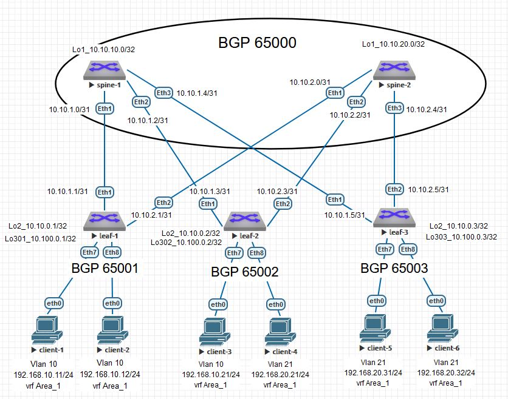

# Домашнее задание №6
### Overlay на основе VxLAN EVPN для L3, VxLAN. L3VNI.

### Схема сети


#
### Конфигурация оборудования

<details>
<summary>spine-1</summary>

[spine-1](Config/spine-1.conf)
```
hostname spine1
!
spanning-tree mode mstp
!
interface Ethernet1
   description leaf-1
   no switchport
   ip address 10.10.1.0/31
!
interface Ethernet2
   description leaf-2
   no switchport
   ip address 10.10.1.2/31
!
interface Ethernet3
   description leaf-3
   no switchport
   ip address 10.10.1.4/31
!
interface Loopback1
   ip address 10.10.10.0/32
!
ip routing
!
ip as-path access-list 10 permit ^$ any
!
ip prefix-list loop
   seq 10 permit 10.10.10.0/32
!
route-map loop permit 10
   match ip address prefix-list loop
!
peer-filter EVPN
   10 match as-range 65001-65003 result accept
!
peer-filter leaf
   10 match as-range 65001-65003 result accept
!
router bgp 65000
   router-id 10.10.10.0
   timers bgp 3 9
   maximum-paths 2
   bgp listen range 10.10.0.0/24 peer-group EVPN peer-filter EVPN
   bgp listen range 10.10.1.0/29 peer-group leaf peer-filter leaf
   neighbor EVPN peer group
   neighbor EVPN next-hop-unchanged
   neighbor EVPN update-source Loopback1
   neighbor EVPN ebgp-multihop 3
   neighbor EVPN password 7 fEJ4wiPVReC6Jv2IoU6ayg==
   neighbor EVPN send-community extended
   neighbor leaf peer group
   neighbor leaf next-hop-self
   neighbor leaf bfd
   neighbor leaf password 7 i4EOoNLfwil9c106ZWb5fA==
   redistribute connected route-map loop
   !
   address-family evpn
      neighbor EVPN activate
   !
   address-family ipv4
      neighbor leaf activate
!
end
```
</details>

<details>
<summary>spine-2</summary>

[spine-2](Config/spine-2.conf)
```
hostname spine-2
!
spanning-tree mode mstp
!
interface Ethernet1
   description leaf-1
   no switchport
   ip address 10.10.2.0/31
!
interface Ethernet2
   description leaf-2
   no switchport
   ip address 10.10.2.2/31
!
interface Ethernet3
   description leaf-3
   no switchport
   ip address 10.10.2.4/31
!
interface Loopback1
   ip address 10.10.20.0/32
!
ip routing
!
ip as-path access-list 10 permit ^$ any
!
ip prefix-list loop
   seq 10 permit 10.10.20.0/32
!
ip route 10.10.0.0/24 Null0
!
route-map loop permit 10
   match ip address prefix-list loop
!
peer-filter EVPN
   10 match as-range 65001-65003 result accept
!
router bgp 65000
   router-id 10.10.20.0
   timers bgp 3 9
   maximum-paths 2
   bgp listen range 10.10.0.0/24 peer-group EVPN peer-filter EVPN
   neighbor EVPN peer group
   neighbor EVPN next-hop-unchanged
   neighbor EVPN update-source Loopback1
   neighbor EVPN ebgp-multihop 3
   neighbor EVPN password 7 fEJ4wiPVReC6Jv2IoU6ayg==
   neighbor EVPN send-community extended
   neighbor 10.10.2.1 remote-as 65001
   neighbor 10.10.2.1 bfd
   neighbor 10.10.2.1 password 7 bz6CP31/O2UqY00pK9TCHA==
   neighbor 10.10.2.3 remote-as 65002
   neighbor 10.10.2.3 bfd
   neighbor 10.10.2.3 password 7 ZSPSfHYyuPxNHlT3xizgcQ==
   neighbor 10.10.2.5 remote-as 65003
   neighbor 10.10.2.5 bfd
   neighbor 10.10.2.5 password 7 ykPvUehIyrSHgZzZXl2GSQ==
   redistribute connected route-map loop
   !
   address-family evpn
      neighbor EVPN activate
   !
   address-family ipv4
      network 10.10.2.0/29
!
end
```
</details>

<details>
<summary>leaf-1</summary>

[leaf-1](Config/leaf-1.conf)
```
hostname leaf-1
!
spanning-tree mode mstp
!
vlan 10
   name Client_1
!
vlan 20
   name Client_2
!
vrf instance Area_1
!
interface Ethernet1
   description spine-1
   no switchport
   ip address 10.10.1.1/31
!
interface Ethernet2
   description spine-2
   no switchport
   ip address 10.10.2.1/31
!
interface Ethernet7
   description Client_1
   switchport access vlan 10
!
interface Ethernet8
   description Client_2
   switchport access vlan 10
!
interface Loopback2
   ip address 10.10.0.1/32
!
interface Loopback301
   description NVE
   ip address 10.100.0.1/32
!
interface Vlan10
   vrf Area_1
   ip address virtual 192.168.10.254/24
!
interface Vxlan1
   vxlan source-interface Loopback301
   vxlan udp-port 4789
   vxlan vlan 10 vni 10010
   vxlan vrf Area_1 vni 999
!
ip virtual-router mac-address 00:00:00:00:00:01
!
ip routing
ip routing vrf Area_1
!
ip prefix-list loop
   seq 10 permit 10.10.0.1/32
   seq 20 permit 10.100.0.1/32
!
route-map loop permit 10
   match ip address prefix-list loop
!
router bgp 65001
   router-id 10.10.0.1
   timers bgp 3 9
   maximum-paths 2
   neighbor EVPN peer group
   neighbor EVPN remote-as 65000
   neighbor EVPN update-source Loopback2
   neighbor EVPN ebgp-multihop 3
   neighbor EVPN password 7 fEJ4wiPVReC6Jv2IoU6ayg==
   neighbor EVPN send-community extended
   neighbor 10.10.1.0 remote-as 65000
   neighbor 10.10.1.0 bfd
   neighbor 10.10.1.0 password 7 7tvg/aRwIygTniCYSXUPEg==
   neighbor 10.10.2.0 remote-as 65000
   neighbor 10.10.2.0 bfd
   neighbor 10.10.2.0 password 7 bz6CP31/O2UqY00pK9TCHA==
   neighbor 10.10.10.0 peer group EVPN
   neighbor 10.10.20.0 peer group EVPN
   redistribute connected route-map loop
   !
   vlan 10
      rd 65001:10010
      route-target both 10:10010
      redistribute learned
   !
   vlan 20
      rd 65001:10020
      route-target both 20:10020
      redistribute learned
   !
   address-family evpn
      neighbor EVPN activate
   !
   address-family ipv4
      network 10.10.1.0/31
      network 10.10.2.0/31
   !
   vrf Area_1
      rd 65001:999
      route-target import evpn 999:999
      route-target export evpn 999:999
!
end
```
</details>

<details>
<summary>leaf-2</summary>

[leaf-2](Config/leaf-2.conf)
```
hostname leaf-2
!
spanning-tree mode mstp
!
vlan 10,20
   name Client
!
vlan 21
!
vrf instance Area_1
!
interface Ethernet1
   description spine-1
   no switchport
   ip address 10.10.1.3/31
!
interface Ethernet2
   description spine-2
   no switchport
   ip address 10.10.2.3/31
!
interface Ethernet7
   description Client_3
   switchport access vlan 10
!
interface Ethernet8
   description Client_4
   switchport access vlan 21
!
interface Loopback2
   ip address 10.10.0.2/32
!
interface Loopback302
   description NVE
   ip address 10.100.0.2/32
!
interface Management1
!
interface Vlan10
   vrf Area_1
   ip address virtual 192.168.10.254/24
!
interface Vlan21
   vrf Area_1
   ip address virtual 192.168.20.254/24
!
interface Vlan103
!
interface Vxlan1
   description VX
   vxlan source-interface Loopback302
   vxlan udp-port 4789
   vxlan vlan 10 vni 10010
   vxlan vlan 20 vni 10020
   vxlan vlan 21 vni 10021
   vxlan vrf Area_1 vni 999
!
ip virtual-router mac-address 00:00:00:00:00:02
!
ip routing
ip routing vrf Area_1
!
ip prefix-list loop
   seq 10 permit 10.10.0.2/32
   seq 20 permit 10.100.0.2/32
!
route-map loop permit 10
   match ip address prefix-list loop
!
router bgp 65002
   router-id 10.10.0.2
   maximum-paths 2
   neighbor EVPN peer group
   neighbor EVPN remote-as 65000
   neighbor EVPN update-source Loopback2
   neighbor EVPN ebgp-multihop 3
   neighbor EVPN password 7 fEJ4wiPVReC6Jv2IoU6ayg==
   neighbor EVPN send-community extended
   neighbor 10.10.1.2 remote-as 65000
   neighbor 10.10.1.2 bfd
   neighbor 10.10.1.2 password 7 ANUhHTpBAeD3CbMkFHzCMQ==
   neighbor 10.10.2.2 remote-as 65000
   neighbor 10.10.2.2 bfd
   neighbor 10.10.2.2 password 7 ZSPSfHYyuPxNHlT3xizgcQ==
   neighbor 10.10.10.0 peer group EVPN
   neighbor 10.10.20.0 peer group EVPN
   redistribute connected route-map loop
   !
   vlan 10
      rd 65002:10010
      route-target both 10:10010
      redistribute learned
   !
   vlan 20
      rd 65002:10020
      route-target both 20:10020
      redistribute learned
   !
   vlan 21
      rd 65002:10021
      route-target both 21:10021
      redistribute learned
   !
   address-family evpn
      neighbor EVPN activate
   !
   address-family ipv4
      network 10.10.1.2/31
      network 10.10.2.2/31
   !
   vrf Area_1
      rd 65002:999
      route-target import evpn 999:999
      route-target export evpn 999:999
!
end
```
</details>

<details>
<summary>leaf-3</summary>

[leaf-3](Config/leaf-3.conf)
```
hostname leaf-3
!
spanning-tree mode mstp
!
vlan 10,20
   name Client
!
vlan 21-22,100,200
!
vrf instance Area_1
!
interface Ethernet1
   description spine-1
   no switchport
   ip address 10.10.1.5/31
!
interface Ethernet2
   description spine-2
   no switchport
   ip address 10.10.2.5/31
!
interface Ethernet7
   description Client_5
   switchport access vlan 21
!
interface Ethernet8
   description Client_6
   switchport access vlan 21
!
interface Loopback2
   ip address 10.10.0.3/32
!
interface Loopback303
   description NVE
   ip address 10.100.0.3/32
!
interface Management1
!
interface Vlan21
   vrf Area_1
   ip address virtual 192.168.20.254/24
!
interface Vxlan1
   vxlan source-interface Loopback303
   vxlan udp-port 4789
   vxlan vlan 21 vni 10021
   vxlan vrf Area_1 vni 999
!
ip virtual-router mac-address 00:00:00:00:00:03
!
ip routing
ip routing vrf Area_1
!
ip prefix-list loop
   seq 10 permit 10.10.0.3/32
   seq 20 permit 10.100.0.3/32
!
route-map loop permit 10
   match ip address prefix-list loop
!
router bgp 65003
   router-id 10.10.0.3
   maximum-paths 2
   neighbor EVPN peer group
   neighbor EVPN remote-as 65000
   neighbor EVPN update-source Loopback2
   neighbor EVPN ebgp-multihop 3
   neighbor EVPN password 7 fEJ4wiPVReC6Jv2IoU6ayg==
   neighbor EVPN send-community extended
   neighbor 10.10.1.4 remote-as 65000
   neighbor 10.10.1.4 bfd
   neighbor 10.10.1.4 password 7 kofiCbtE3TdA+mdiQdM2ag==
   neighbor 10.10.2.4 remote-as 65000
   neighbor 10.10.2.4 bfd
   neighbor 10.10.2.4 password 7 ykPvUehIyrSHgZzZXl2GSQ==
   neighbor 10.10.10.0 peer group EVPN
   neighbor 10.10.20.0 peer group EVPN
   redistribute connected route-map loop
   !
   vlan 100
      rd 65003:10010
      route-target both 10:10010
      redistribute learned
   !
   vlan 200
      rd 65003:10020
      route-target both 20:10020
      redistribute learned
   !
   vlan 21
      rd 65003:10021
      route-target both 21:10021
      redistribute learned
   !
   address-family evpn
      neighbor EVPN activate
   !
   address-family ipv4
      network 10.10.1.4/31
      network 10.10.2.4/31
   !
   vrf Area_1
      rd 65003:999
      route-target import evpn 999:999
      route-target export evpn 999:999
!
end
```
</details>

#
### Проверка связанности клиентов по L3

<details>
<summary>leaf-1</summary>

- #### leaf-1
```
leaf-1#sh ip route vrf Area_1

 B E      192.168.10.21/32 [200/0] via VTEP 10.100.0.2 VNI 999 router-mac 50:00:00:03:37:66 local-interface Vxl1
 C        192.168.10.0/24 is directly connected, Vlan10
 B E      192.168.20.21/32 [200/0] via VTEP 10.100.0.2 VNI 999 router-mac 50:00:00:03:37:66 local-interface Vxl1
 B E      192.168.20.31/32 [200/0] via VTEP 10.100.0.3 VNI 999 router-mac 50:00:00:15:f4:e8 local-interface Vxl1
 B E      192.168.20.32/32 [200/0] via VTEP 10.100.0.3 VNI 999 router-mac 50:00:00:15:f4:e8 local-interface Vxl1

leaf-1#show bgp evpn route-type ip-prefix ipv4
BGP routing table information for VRF default
Router identifier 10.10.0.1, local AS number 65001
Route status codes: * - valid, > - active, S - Stale, E - ECMP head, e - ECMP
                    c - Contributing to ECMP, % - Pending BGP convergence
Origin codes: i - IGP, e - EGP, ? - incomplete
AS Path Attributes: Or-ID - Originator ID, C-LST - Cluster List, LL Nexthop - Link Local Nexthop

          Network                Next Hop              Metric  LocPref Weight  Path


leaf-1#sh bgp evpn route-type mac-ip
BGP routing table information for VRF default
Router identifier 10.10.0.1, local AS number 65001
Route status codes: * - valid, > - active, S - Stale, E - ECMP head, e - ECMP
                    c - Contributing to ECMP, % - Pending BGP convergence
Origin codes: i - IGP, e - EGP, ? - incomplete
AS Path Attributes: Or-ID - Originator ID, C-LST - Cluster List, LL Nexthop - Link Local Nexthop

          Network                Next Hop              Metric  LocPref Weight  Path
 * >      RD: 65001:10010 mac-ip 0050.7966.6806
                                 -                     -       -       0       i
 * >      RD: 65001:10010 mac-ip 0050.7966.6806 192.168.10.12
                                 -                     -       -       0       i
 * >Ec    RD: 65002:10021 mac-ip 0050.7966.6807
                                 10.100.0.2            -       100     0       65000 65002 i
 *  ec    RD: 65002:10021 mac-ip 0050.7966.6807
                                 10.100.0.2            -       100     0       65000 65002 i
 * >Ec    RD: 65002:10021 mac-ip 0050.7966.6807 192.168.20.21
                                 10.100.0.2            -       100     0       65000 65002 i
 *  ec    RD: 65002:10021 mac-ip 0050.7966.6807 192.168.20.21
                                 10.100.0.2            -       100     0       65000 65002 i
 * >Ec    RD: 65003:10021 mac-ip 0050.7966.6808
                                 10.100.0.3            -       100     0       65000 65003 i
 *  ec    RD: 65003:10021 mac-ip 0050.7966.6808
                                 10.100.0.3            -       100     0       65000 65003 i
 * >Ec    RD: 65003:10021 mac-ip 0050.7966.6808 192.168.20.31
                                 10.100.0.3            -       100     0       65000 65003 i
 *  ec    RD: 65003:10021 mac-ip 0050.7966.6808 192.168.20.31
                                 10.100.0.3            -       100     0       65000 65003 i
 * >Ec    RD: 65003:10021 mac-ip 0050.7966.6809
                                 10.100.0.3            -       100     0       65000 65003 i
 *  ec    RD: 65003:10021 mac-ip 0050.7966.6809
                                 10.100.0.3            -       100     0       65000 65003 i
 * >Ec    RD: 65003:10021 mac-ip 0050.7966.6809 192.168.20.32
                                 10.100.0.3            -       100     0       65000 65003 i
 *  ec    RD: 65003:10021 mac-ip 0050.7966.6809 192.168.20.32
                                 10.100.0.3            -       100     0       65000 65003 i
 * >      RD: 65001:10010 mac-ip 0050.7966.680a
                                 -                     -       -       0       i
 * >      RD: 65001:10010 mac-ip 0050.7966.680a 192.168.10.11
                                 -                     -       -       0       i
 * >Ec    RD: 65002:10010 mac-ip 0050.7966.680b
                                 10.100.0.2            -       100     0       65000 65002 i
 *  ec    RD: 65002:10010 mac-ip 0050.7966.680b
                                 10.100.0.2            -       100     0       65000 65002 i
 * >Ec    RD: 65002:10010 mac-ip 0050.7966.680b 192.168.10.21
                                 10.100.0.2            -       100     0       65000 65002 i
 *  ec    RD: 65002:10010 mac-ip 0050.7966.680b 192.168.10.21
                                 10.100.0.2            -       100     0       65000 65002 i


leaf-1#sh arp vrf Area_1
Address         Age (sec)  Hardware Addr   Interface
192.168.10.11     0:02:24  0050.7966.680a  Vlan10, Ethernet7
192.168.10.12     0:01:44  0050.7966.6806  Vlan10, Ethernet8
192.168.10.21           -  0050.7966.680b  Vlan10, Vxlan1


leaf-1#sh interfaces vxlan 1
Vxlan1 is up, line protocol is up (connected)
  Hardware is Vxlan
  Source interface is Loopback301 and is active with 10.100.0.1
  Listening on UDP port 4789
  Replication/Flood Mode is headend with Flood List Source: EVPN
  Remote MAC learning via EVPN
  VNI mapping to VLANs
  Static VLAN to VNI mapping is
    [10, 10010]
  Dynamic VLAN to VNI mapping for 'evpn' is
    [4094, 999]
  Note: All Dynamic VLANs used by VCS are internal VLANs.
        Use 'show vxlan vni' for details.
  Static VRF to VNI mapping is
   [Area_1, 999]
  Headend replication flood vtep list is:
    10 10.100.0.2
  Shared Router MAC is 0000.0000.0000


leaf-1#show vxlan vni
VNI to VLAN Mapping for Vxlan1
VNI         VLAN       Source       Interface       802.1Q Tag
----------- ---------- ------------ --------------- ----------
10010       10         static       Ethernet7       untagged
                                    Ethernet8       untagged
                                    Vxlan1          10

VNI to dynamic VLAN Mapping for Vxlan1
VNI       VLAN       VRF          Source
--------- ---------- ------------ ------------
999       4094       Area_1       evpn
```
</details>


<details>
<summary>leaf-2</summary>

- #### leaf-2
```
leaf-2#sh ip route vrf Area_1

 B E      192.168.10.11/32 [200/0] via VTEP 10.100.0.1 VNI 999 router-mac 50:00:00:d5:5d:c0 local-interface Vxl1
 B E      192.168.10.12/32 [200/0] via VTEP 10.100.0.1 VNI 999 router-mac 50:00:00:d5:5d:c0 local-interface Vxl1
 C        192.168.10.0/24 is directly connected, Vlan10
 B E      192.168.20.31/32 [200/0] via VTEP 10.100.0.3 VNI 999 router-mac 50:00:00:15:f4:e8 local-interface Vxl1
 B E      192.168.20.32/32 [200/0] via VTEP 10.100.0.3 VNI 999 router-mac 50:00:00:15:f4:e8 local-interface Vxl1
 C        192.168.20.0/24 is directly connected, Vlan21


leaf-2#sh bgp evpn route-type mac-ip
BGP routing table information for VRF default
Router identifier 10.10.0.2, local AS number 65002
Route status codes: * - valid, > - active, S - Stale, E - ECMP head, e - ECMP
                    c - Contributing to ECMP, % - Pending BGP convergence
Origin codes: i - IGP, e - EGP, ? - incomplete
AS Path Attributes: Or-ID - Originator ID, C-LST - Cluster List, LL Nexthop - Link Local Nexthop

          Network                Next Hop              Metric  LocPref Weight  Path
 * >Ec    RD: 65001:10010 mac-ip 0050.7966.6806
                                 10.100.0.1            -       100     0       65000 65001 i
 *  ec    RD: 65001:10010 mac-ip 0050.7966.6806
                                 10.100.0.1            -       100     0       65000 65001 i
 * >Ec    RD: 65001:10010 mac-ip 0050.7966.6806 192.168.10.12
                                 10.100.0.1            -       100     0       65000 65001 i
 *  ec    RD: 65001:10010 mac-ip 0050.7966.6806 192.168.10.12
                                 10.100.0.1            -       100     0       65000 65001 i
 * >      RD: 65002:10021 mac-ip 0050.7966.6807
                                 -                     -       -       0       i
 * >      RD: 65002:10021 mac-ip 0050.7966.6807 192.168.20.21
                                 -                     -       -       0       i
 * >Ec    RD: 65003:10021 mac-ip 0050.7966.6808
                                 10.100.0.3            -       100     0       65000 65003 i
 *  ec    RD: 65003:10021 mac-ip 0050.7966.6808
                                 10.100.0.3            -       100     0       65000 65003 i
 * >Ec    RD: 65003:10021 mac-ip 0050.7966.6808 192.168.20.31
                                 10.100.0.3            -       100     0       65000 65003 i
 *  ec    RD: 65003:10021 mac-ip 0050.7966.6808 192.168.20.31
                                 10.100.0.3            -       100     0       65000 65003 i
 * >Ec    RD: 65003:10021 mac-ip 0050.7966.6809
                                 10.100.0.3            -       100     0       65000 65003 i
 *  ec    RD: 65003:10021 mac-ip 0050.7966.6809
                                 10.100.0.3            -       100     0       65000 65003 i
 * >Ec    RD: 65003:10021 mac-ip 0050.7966.6809 192.168.20.32
                                 10.100.0.3            -       100     0       65000 65003 i
 *  ec    RD: 65003:10021 mac-ip 0050.7966.6809 192.168.20.32
                                 10.100.0.3            -       100     0       65000 65003 i
 * >Ec    RD: 65001:10010 mac-ip 0050.7966.680a
                                 10.100.0.1            -       100     0       65000 65001 i
 *  ec    RD: 65001:10010 mac-ip 0050.7966.680a
                                 10.100.0.1            -       100     0       65000 65001 i
 * >Ec    RD: 65001:10010 mac-ip 0050.7966.680a 192.168.10.11
                                 10.100.0.1            -       100     0       65000 65001 i
 *  ec    RD: 65001:10010 mac-ip 0050.7966.680a 192.168.10.11
                                 10.100.0.1            -       100     0       65000 65001 i
 * >      RD: 65002:10010 mac-ip 0050.7966.680b
                                 -                     -       -       0       i
 * >      RD: 65002:10010 mac-ip 0050.7966.680b 192.168.10.21
                                 -                     -       -       0       i


leaf-2#show bgp evpn route-type ip-prefix ipv4
BGP routing table information for VRF default
Router identifier 10.10.0.2, local AS number 65002
Route status codes: * - valid, > - active, S - Stale, E - ECMP head, e - ECMP
                    c - Contributing to ECMP, % - Pending BGP convergence
Origin codes: i - IGP, e - EGP, ? - incomplete
AS Path Attributes: Or-ID - Originator ID, C-LST - Cluster List, LL Nexthop - Link Local Nexthop

          Network                Next Hop              Metric  LocPref Weight  Path

leaf-2#sh arp vrf Area_1
Address         Age (sec)  Hardware Addr   Interface
192.168.10.11           -  0050.7966.680a  Vlan10, Vxlan1
192.168.10.12           -  0050.7966.6806  Vlan10, Vxlan1
192.168.10.21     0:03:26  0050.7966.680b  Vlan10, Ethernet7
192.168.20.21     0:01:10  0050.7966.6807  Vlan21, Ethernet8
192.168.20.31           -  0050.7966.6808  Vlan21, Vxlan1
192.168.20.32           -  0050.7966.6809  Vlan21, Vxlan1


leaf-2#sh interfaces vxlan 1
Vxlan1 is up, line protocol is up (connected)
  Hardware is Vxlan
  Description: VX
  Source interface is Loopback302 and is active with 10.100.0.2
  Listening on UDP port 4789
  Replication/Flood Mode is headend with Flood List Source: EVPN
  Remote MAC learning via EVPN
  VNI mapping to VLANs
  Static VLAN to VNI mapping is
    [10, 10010]       [20, 10020]       [21, 10021]
  Dynamic VLAN to VNI mapping for 'evpn' is
    [4094, 999]
  Note: All Dynamic VLANs used by VCS are internal VLANs.
        Use 'show vxlan vni' for details.
  Static VRF to VNI mapping is
   [Area_1, 999]
  Headend replication flood vtep list is:
    10 10.100.0.1
    21 10.100.0.3
  Shared Router MAC is 0000.0000.0000

leaf-2#show vxlan vni
VNI to VLAN Mapping for Vxlan1
VNI         VLAN       Source       Interface       802.1Q Tag
----------- ---------- ------------ --------------- ----------
10010       10         static       Ethernet7       untagged
                                    Vxlan1          10
10020       20         static       Vxlan1          20
10021       21         static       Ethernet8       untagged
                                    Vxlan1          21

VNI to dynamic VLAN Mapping for Vxlan1
VNI       VLAN       VRF          Source
--------- ---------- ------------ ------------
999       4094       Area_1       evpn

```
</details>

<details>
<summary>leaf-3</summary>

- ### leaf-3
```
leaf-3#sh ip route vrf Area_1

 B E      192.168.10.11/32 [200/0] via VTEP 10.100.0.1 VNI 999 router-mac 50:00:00:d5:5d:c0 local-interface Vxl1
 B E      192.168.10.12/32 [200/0] via VTEP 10.100.0.1 VNI 999 router-mac 50:00:00:d5:5d:c0 local-interface Vxl1
 B E      192.168.10.21/32 [200/0] via VTEP 10.100.0.2 VNI 999 router-mac 50:00:00:03:37:66 local-interface Vxl1
 B E      192.168.20.21/32 [200/0] via VTEP 10.100.0.2 VNI 999 router-mac 50:00:00:03:37:66 local-interface Vxl1
 C        192.168.20.0/24 is directly connected, Vlan21

leaf-3#sh bgp evpn route-type mac-ip
BGP routing table information for VRF default
Router identifier 10.10.0.3, local AS number 65003
Route status codes: * - valid, > - active, S - Stale, E - ECMP head, e - ECMP
                    c - Contributing to ECMP, % - Pending BGP convergence
Origin codes: i - IGP, e - EGP, ? - incomplete
AS Path Attributes: Or-ID - Originator ID, C-LST - Cluster List, LL Nexthop - Link Local Nexthop

          Network                Next Hop              Metric  LocPref Weight  Path
 * >Ec    RD: 65001:10010 mac-ip 0050.7966.6806
                                 10.100.0.1            -       100     0       65000 65001 i
 *  ec    RD: 65001:10010 mac-ip 0050.7966.6806
                                 10.100.0.1            -       100     0       65000 65001 i
 * >Ec    RD: 65001:10010 mac-ip 0050.7966.6806 192.168.10.12
                                 10.100.0.1            -       100     0       65000 65001 i
 *  ec    RD: 65001:10010 mac-ip 0050.7966.6806 192.168.10.12
                                 10.100.0.1            -       100     0       65000 65001 i
 * >Ec    RD: 65002:10021 mac-ip 0050.7966.6807
                                 10.100.0.2            -       100     0       65000 65002 i
 *  ec    RD: 65002:10021 mac-ip 0050.7966.6807
                                 10.100.0.2            -       100     0       65000 65002 i
 * >Ec    RD: 65002:10021 mac-ip 0050.7966.6807 192.168.20.21
                                 10.100.0.2            -       100     0       65000 65002 i
 *  ec    RD: 65002:10021 mac-ip 0050.7966.6807 192.168.20.21
                                 10.100.0.2            -       100     0       65000 65002 i
 * >      RD: 65003:10021 mac-ip 0050.7966.6808
                                 -                     -       -       0       i
 * >      RD: 65003:10021 mac-ip 0050.7966.6808 192.168.20.31
                                 -                     -       -       0       i
 * >      RD: 65003:10021 mac-ip 0050.7966.6809
                                 -                     -       -       0       i
 * >      RD: 65003:10021 mac-ip 0050.7966.6809 192.168.20.32
                                 -                     -       -       0       i
 * >Ec    RD: 65001:10010 mac-ip 0050.7966.680a
                                 10.100.0.1            -       100     0       65000 65001 i
 *  ec    RD: 65001:10010 mac-ip 0050.7966.680a
                                 10.100.0.1            -       100     0       65000 65001 i
 * >Ec    RD: 65001:10010 mac-ip 0050.7966.680a 192.168.10.11
                                 10.100.0.1            -       100     0       65000 65001 i
 *  ec    RD: 65001:10010 mac-ip 0050.7966.680a 192.168.10.11
                                 10.100.0.1            -       100     0       65000 65001 i
 * >Ec    RD: 65002:10010 mac-ip 0050.7966.680b
                                 10.100.0.2            -       100     0       65000 65002 i
 *  ec    RD: 65002:10010 mac-ip 0050.7966.680b
                                 10.100.0.2            -       100     0       65000 65002 i
 * >Ec    RD: 65002:10010 mac-ip 0050.7966.680b 192.168.10.21
                                 10.100.0.2            -       100     0       65000 65002 i
 *  ec    RD: 65002:10010 mac-ip 0050.7966.680b 192.168.10.21
                                 10.100.0.2            -       100     0       65000 65002 i
                                 leaf-3#sh bgp evpn route-type mac-ip
BGP routing table information for VRF default
Router identifier 10.10.0.3, local AS number 65003
Route status codes: * - valid, > - active, S - Stale, E - ECMP head, e - ECMP
                    c - Contributing to ECMP, % - Pending BGP convergence
Origin codes: i - IGP, e - EGP, ? - incomplete
AS Path Attributes: Or-ID - Originator ID, C-LST - Cluster List, LL Nexthop - Link Local Nexthop

          Network                Next Hop              Metric  LocPref Weight  Path
 * >Ec    RD: 65001:10010 mac-ip 0050.7966.6806
                                 10.100.0.1            -       100     0       65000 65001 i
 *  ec    RD: 65001:10010 mac-ip 0050.7966.6806
                                 10.100.0.1            -       100     0       65000 65001 i
 * >Ec    RD: 65001:10010 mac-ip 0050.7966.6806 192.168.10.12
                                 10.100.0.1            -       100     0       65000 65001 i
 *  ec    RD: 65001:10010 mac-ip 0050.7966.6806 192.168.10.12
                                 10.100.0.1            -       100     0       65000 65001 i
 * >Ec    RD: 65002:10021 mac-ip 0050.7966.6807
                                 10.100.0.2            -       100     0       65000 65002 i
 *  ec    RD: 65002:10021 mac-ip 0050.7966.6807
                                 10.100.0.2            -       100     0       65000 65002 i
 * >Ec    RD: 65002:10021 mac-ip 0050.7966.6807 192.168.20.21
                                 10.100.0.2            -       100     0       65000 65002 i
 *  ec    RD: 65002:10021 mac-ip 0050.7966.6807 192.168.20.21
                                 10.100.0.2            -       100     0       65000 65002 i
 * >      RD: 65003:10021 mac-ip 0050.7966.6808
                                 -                     -       -       0       i
 * >      RD: 65003:10021 mac-ip 0050.7966.6808 192.168.20.31
                                 -                     -       -       0       i
 * >      RD: 65003:10021 mac-ip 0050.7966.6809
                                 -                     -       -       0       i
 * >      RD: 65003:10021 mac-ip 0050.7966.6809 192.168.20.32
                                 -                     -       -       0       i
 * >Ec    RD: 65001:10010 mac-ip 0050.7966.680a
                                 10.100.0.1            -       100     0       65000 65001 i
 *  ec    RD: 65001:10010 mac-ip 0050.7966.680a
                                 10.100.0.1            -       100     0       65000 65001 i
 * >Ec    RD: 65001:10010 mac-ip 0050.7966.680a 192.168.10.11
                                 10.100.0.1            -       100     0       65000 65001 i
 *  ec    RD: 65001:10010 mac-ip 0050.7966.680a 192.168.10.11
                                 10.100.0.1            -       100     0       65000 65001 i
 * >Ec    RD: 65002:10010 mac-ip 0050.7966.680b
                                 10.100.0.2            -       100     0       65000 65002 i
 *  ec    RD: 65002:10010 mac-ip 0050.7966.680b
                                 10.100.0.2            -       100     0       65000 65002 i
 * >Ec    RD: 65002:10010 mac-ip 0050.7966.680b 192.168.10.21
                                 10.100.0.2            -       100     0       65000 65002 i
 *  ec    RD: 65002:10010 mac-ip 0050.7966.680b 192.168.10.21
                                 10.100.0.2            -       100     0       65000 65002 i


leaf-3#sh bgp evpn route-type ip-prefix ipv4
BGP routing table information for VRF default
Router identifier 10.10.0.3, local AS number 65003
Route status codes: * - valid, > - active, S - Stale, E - ECMP head, e - ECMP
                    c - Contributing to ECMP, % - Pending BGP convergence
Origin codes: i - IGP, e - EGP, ? - incomplete
AS Path Attributes: Or-ID - Originator ID, C-LST - Cluster List, LL Nexthop - Link Local Nexthop

          Network                Next Hop              Metric  LocPref Weight  Path


leaf-3#sh arp vrf Area_1
Address         Age (sec)  Hardware Addr   Interface
192.168.20.21           -  0050.7966.6807  Vlan21, Vxlan1
192.168.20.31     0:03:19  0050.7966.6808  Vlan21, Ethernet7
192.168.20.32     0:03:10  0050.7966.6809  Vlan21, Ethernet8


leaf-3#sh interfaces vxlan 1
Vxlan1 is up, line protocol is up (connected)
  Hardware is Vxlan
  Source interface is Loopback303 and is active with 10.100.0.3
  Listening on UDP port 4789
  Replication/Flood Mode is headend with Flood List Source: EVPN
  Remote MAC learning via EVPN
  VNI mapping to VLANs
  Static VLAN to VNI mapping is
    [21, 10021]
  Dynamic VLAN to VNI mapping for 'evpn' is
    [4094, 999]
  Note: All Dynamic VLANs used by VCS are internal VLANs.
        Use 'show vxlan vni' for details.
  Static VRF to VNI mapping is
   [Area_1, 999]
  Headend replication flood vtep list is:
    21 10.100.0.2
  Shared Router MAC is 0000.0000.0000

leaf-3#show vxlan vni
VNI to VLAN Mapping for Vxlan1
VNI         VLAN       Source       Interface       802.1Q Tag
----------- ---------- ------------ --------------- ----------
10021       21         static       Ethernet7       untagged
                                    Ethernet8       untagged
                                    Vxlan1          21

VNI to dynamic VLAN Mapping for Vxlan1
VNI       VLAN       VRF          Source
--------- ---------- ------------ ------------
999       4094       Area_1       evpn

```
</details>


#
### Проверка связанности  по ping

<details>
<summary>Client 1</summary>

- ### Client 1
```

VPCS> ping 192.168.10.12 -c 2

84 bytes from 192.168.10.12 icmp_seq=1 ttl=64 time=3.447 ms
84 bytes from 192.168.10.12 icmp_seq=2 ttl=64 time=3.561 ms

VPCS> ping 192.168.10.21 -c 2

84 bytes from 192.168.10.21 icmp_seq=1 ttl=64 time=23.536 ms
84 bytes from 192.168.10.21 icmp_seq=2 ttl=64 time=10.403 ms

VPCS> ping 192.168.20.21 -c 2

84 bytes from 192.168.20.21 icmp_seq=1 ttl=62 time=28.788 ms
84 bytes from 192.168.20.21 icmp_seq=2 ttl=62 time=13.219 ms

VPCS> ping 192.168.20.31 -c 2

84 bytes from 192.168.20.31 icmp_seq=1 ttl=62 time=32.711 ms
84 bytes from 192.168.20.31 icmp_seq=2 ttl=62 time=11.152 ms

VPCS> ping 192.168.20.32 -c 2

84 bytes from 192.168.20.32 icmp_seq=1 ttl=62 time=16.994 ms
84 bytes from 192.168.20.32 icmp_seq=2 ttl=62 time=14.182 ms

```
</details>

<details>
<summary>Client 4</summary>

- ### Client 4
```
VPCS> ping 192.168.10.11 -c 2

84 bytes from 192.168.10.11 icmp_seq=1 ttl=62 time=30.034 ms
84 bytes from 192.168.10.11 icmp_seq=2 ttl=62 time=11.713 ms

VPCS> ping 192.168.10.12 -c 2

84 bytes from 192.168.10.12 icmp_seq=1 ttl=62 time=26.173 ms
84 bytes from 192.168.10.12 icmp_seq=2 ttl=62 time=13.091 ms

VPCS> ping 192.168.10.21 -c 2

84 bytes from 192.168.10.21 icmp_seq=1 ttl=63 time=29.785 ms
84 bytes from 192.168.10.21 icmp_seq=2 ttl=63 time=4.692 ms

VPCS> ping 192.168.20.31 -c 2

84 bytes from 192.168.20.31 icmp_seq=1 ttl=64 time=23.036 ms
84 bytes from 192.168.20.31 icmp_seq=2 ttl=64 time=11.873 ms

VPCS> ping 192.168.20.32 -c 2

84 bytes from 192.168.20.32 icmp_seq=1 ttl=64 time=11.001 ms
84 bytes from 192.168.20.32 icmp_seq=2 ttl=64 time=11.354 ms

```
</details>

#