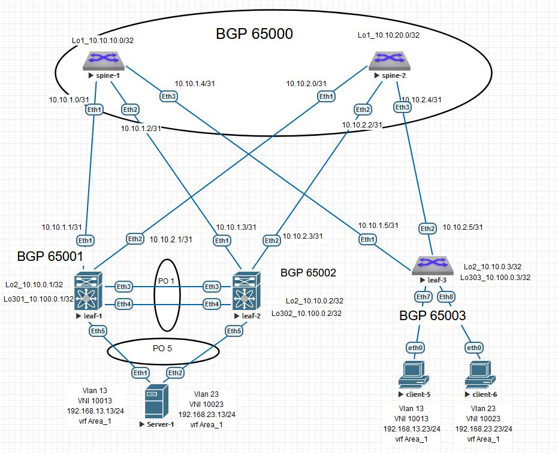

# Домашнее задание №7
### VXLAN. Multihoming

### Схема сети




#
### Конфигурация оборудования

<details>
<summary>spine-1</summary>

[spine-1](Config/spine-1.conf)
```
hostname spine1
!
spanning-tree mode mstp
!
interface Ethernet1
   description leaf-1
   no switchport
   ip address 10.10.1.0/31
!
interface Ethernet2
   description leaf-2
   no switchport
   ip address 10.10.1.2/31
!
interface Ethernet3
   description leaf-3
   no switchport
   ip address 10.10.1.4/31
!
interface Loopback1
   ip address 10.10.10.0/32
!
interface Management1
!
ip routing
!
ip as-path access-list 10 permit ^$ any
!
ip prefix-list loop
   seq 10 permit 10.10.10.0/32
!
route-map loop permit 10
   match ip address prefix-list loop
!
peer-filter EVPN
   10 match as-range 65001-65003 result accept
!
peer-filter leaf
   10 match as-range 65001-65003 result accept
!
router bgp 65000
   router-id 10.10.10.0
   timers bgp 3 9
   maximum-paths 2
   bgp listen range 10.10.0.0/24 peer-group EVPN peer-filter EVPN
   bgp listen range 10.10.1.0/29 peer-group leaf peer-filter leaf
   neighbor EVPN peer group
   neighbor EVPN next-hop-unchanged
   neighbor EVPN update-source Loopback1
   neighbor EVPN ebgp-multihop 3
   neighbor EVPN password 7 fEJ4wiPVReC6Jv2IoU6ayg==
   neighbor EVPN send-community extended
   neighbor leaf peer group
   neighbor leaf next-hop-self
   neighbor leaf bfd
   neighbor leaf password 7 i4EOoNLfwil9c106ZWb5fA==
   redistribute connected route-map loop
   !
   address-family evpn
      neighbor EVPN activate
   !
   address-family ipv4
      neighbor leaf activate
!
end

```
</details>

<details>
<summary>spine-2</summary>

[spine-2](Config/spine-2.conf)
```

hostname spine-2
!
spanning-tree mode mstp
no spanning-tree vlan-id 4094
!
interface Ethernet1
   description leaf-1
   no switchport
   ip address 10.10.2.0/31
!
interface Ethernet2
   description leaf-2
   no switchport
   ip address 10.10.2.2/31
!
interface Ethernet3
   description leaf-3
   no switchport
   ip address 10.10.2.4/31
!
interface Loopback1
   ip address 10.10.20.0/32
!
interface Management1
!
ip routing
!
ip as-path access-list 10 permit ^$ any
!
ip prefix-list loop
   seq 10 permit 10.10.20.0/32
!
ip route 10.10.0.0/24 Null0
!
route-map loop permit 10
   match ip address prefix-list loop
!
peer-filter EVPN
   10 match as-range 65001-65003 result accept
!
router bgp 65000
   router-id 10.10.20.0
   timers bgp 3 9
   maximum-paths 2
   bgp listen range 10.10.0.0/24 peer-group EVPN peer-filter EVPN
   neighbor EVPN peer group
   neighbor EVPN next-hop-unchanged
   neighbor EVPN update-source Loopback1
   neighbor EVPN ebgp-multihop 3
   neighbor EVPN password 7 fEJ4wiPVReC6Jv2IoU6ayg==
   neighbor EVPN send-community extended
   neighbor 10.10.2.1 remote-as 65001
   neighbor 10.10.2.1 bfd
   neighbor 10.10.2.1 password 7 bz6CP31/O2UqY00pK9TCHA==
   neighbor 10.10.2.3 remote-as 65002
   neighbor 10.10.2.3 bfd
   neighbor 10.10.2.3 password 7 ZSPSfHYyuPxNHlT3xizgcQ==
   neighbor 10.10.2.5 remote-as 65003
   neighbor 10.10.2.5 bfd
   neighbor 10.10.2.5 password 7 ykPvUehIyrSHgZzZXl2GSQ==
   redistribute connected route-map loop
   !
   address-family evpn
      neighbor EVPN activate
   !
   address-family ipv4
      network 10.10.2.0/29
!
end
```
</details>

<details>
<summary>leaf-1</summary>

[leaf-1](Config/leaf-1.conf)
```
hostname leaf-1
!
spanning-tree mode mstp
no spanning-tree vlan-id 4094
!
vlan 10
   name Client_1
!
vlan 13,23
!
vlan 20
   name Client_2
!
vlan 4094
   trunk group mlag
!
vrf instance Area_1
!
interface Port-Channel1
   description mlag
   switchport mode trunk
   switchport trunk group mlag
!
interface Port-Channel5
   description Server
   switchport trunk allowed vlan 13,23
   switchport mode trunk
   mlag 5
!
interface Ethernet1
   description spine-1
   no switchport
   ip address 10.10.1.1/31
!
interface Ethernet2
   description spine-2
   no switchport
   ip address 10.10.2.1/31
!
interface Ethernet3
   description to-leaf-2
   channel-group 1 mode active
!
interface Ethernet4
   description to-leaf-2
   channel-group 1 mode active
!
interface Ethernet5
   description to-Server
   channel-group 5 mode active
!
interface Ethernet6
   shutdown
!
interface Ethernet7
   description Client_1
   switchport access vlan 10
!
interface Ethernet8
   description Client_2
   switchport access vlan 10
!
interface Loopback2
   ip address 10.10.0.1/32
!
interface Loopback301
   description NVE
   ip address 10.100.0.1/32
!
interface Management1
!
interface Vlan10
   vrf Area_1
   ip address virtual 192.168.10.254/24
!
interface Vlan13
   vrf Area_1
   ip address virtual 192.168.13.254/24
!
interface Vlan23
   vrf Area_1
   ip address virtual 192.168.23.254/24
!
interface Vlan4094
   ip address 10.100.100.0/31
!
interface Vxlan1
   vxlan source-interface Loopback301
   vxlan udp-port 4789
   vxlan vlan 10 vni 10010
   vxlan vlan 13 vni 10013
   vxlan vlan 23 vni 10023
   vxlan vrf Area_1 vni 10001
   vxlan virtual-vtep local-interface Loopback301
!
ip virtual-router mac-address 00:00:00:00:00:01
!
ip routing
ip routing vrf Area_1
!
ip prefix-list loop
   seq 10 permit 10.10.0.1/32
   seq 20 permit 10.100.0.1/32
!
mlag configuration
   domain-id mlag1
   local-interface Vlan4094
   peer-address 10.100.100.1
   peer-link Port-Channel1
!
route-map loop permit 10
   match ip address prefix-list loop
!
router bgp 65001
   router-id 10.10.0.1
   timers bgp 3 9
   maximum-paths 2
   neighbor EVPN peer group
   neighbor EVPN remote-as 65000
   neighbor EVPN update-source Loopback2
   neighbor EVPN ebgp-multihop 3
   neighbor EVPN password 7 fEJ4wiPVReC6Jv2IoU6ayg==
   neighbor EVPN send-community extended
   neighbor 10.10.1.0 remote-as 65000
   neighbor 10.10.1.0 bfd
   neighbor 10.10.1.0 password 7 7tvg/aRwIygTniCYSXUPEg==
   neighbor 10.10.2.0 remote-as 65000
   neighbor 10.10.2.0 bfd
   neighbor 10.10.2.0 password 7 bz6CP31/O2UqY00pK9TCHA==
   neighbor 10.10.10.0 peer group EVPN
   neighbor 10.10.20.0 peer group EVPN
   redistribute connected route-map loop
   !
   vlan 10
      rd 65001:10010
      route-target both 10:10010
      redistribute learned
   !
   vlan 13
      rd 65001:10013
      route-target both 13:13
      redistribute learned
   !
   vlan 20
      rd 65001:10020
      route-target both 20:10020
      redistribute learned
   !
   vlan 23
      rd 65001:10023
      route-target both 23:23
      redistribute learned
   !
   address-family evpn
      neighbor EVPN activate
   !
   address-family ipv4
      network 10.10.1.0/31
      network 10.10.2.0/31
   !
   vrf Area_1
      rd 65001:10001
      route-target import evpn 10001:10001
      route-target export evpn 10001:10001
      redistribute connected
!
end
```
</details>

<details>
<summary>leaf-2</summary>

[leaf-2](Config/leaf-2.conf)
```
hostname leaf-2
!
spanning-tree mode mstp
no spanning-tree vlan-id 4094
!
vlan 10,20
   name Client
!
vlan 13,21,23
!
vlan 4094
   trunk group mlag
!
vrf instance Area_1
!
interface Port-Channel1
   description mlag
   switchport mode trunk
   switchport trunk group mlag
!
interface Port-Channel5
   description Server
   switchport trunk allowed vlan 13,23
   switchport mode trunk
   mlag 5
!
interface Ethernet1
   description spine-1
   no switchport
   ip address 10.10.1.3/31
!
interface Ethernet2
   description spine-2
   no switchport
   ip address 10.10.2.3/31
!
interface Ethernet3
   description leaf-1
   channel-group 1 mode active
!
interface Ethernet4
   description leaf-1
   channel-group 1 mode active
!
interface Ethernet5
   description Server
   channel-group 5 mode active
!
interface Ethernet6
   shutdown
!
interface Ethernet7
   description Client_3
   switchport access vlan 10
!
interface Ethernet8
   description Client_4
   switchport access vlan 21
!
interface Loopback2
   ip address 10.10.0.2/32
!
interface Loopback302
   description NVE
   ip address 10.100.0.2/32
!
interface Management1
!
interface Vlan10
   vrf Area_1
   ip address virtual 192.168.10.254/24
!
interface Vlan13
   vrf Area_1
   ip address virtual 192.168.13.254/24
!
interface Vlan21
   vrf Area_1
   ip address virtual 192.168.20.254/24
!
interface Vlan23
   vrf Area_1
   ip address virtual 192.168.23.254/24
!
interface Vlan103
!
interface Vlan4094
   ip address 10.100.100.1/31
!
interface Vxlan1
   description VX
   vxlan source-interface Loopback302
   vxlan udp-port 4789
   vxlan vlan 10 vni 10010
   vxlan vlan 13 vni 10013
   vxlan vlan 20 vni 10020
   vxlan vlan 21 vni 10021
   vxlan vlan 23 vni 10023
   vxlan vrf Area_1 vni 10001
   vxlan virtual-vtep local-interface Loopback302
!
ip virtual-router mac-address 00:00:00:00:00:02
!
ip routing
ip routing vrf Area_1
!
ip prefix-list loop
   seq 10 permit 10.10.0.2/32
   seq 20 permit 10.100.0.2/32
!
mlag configuration
   domain-id mlag1
   local-interface Vlan4094
   peer-address 10.100.100.0
   peer-link Port-Channel1
!
route-map loop permit 10
   match ip address prefix-list loop
!
router bgp 65002
   router-id 10.10.0.2
   maximum-paths 2
   neighbor EVPN peer group
   neighbor EVPN remote-as 65000
   neighbor EVPN update-source Loopback2
   neighbor EVPN ebgp-multihop 3
   neighbor EVPN password 7 fEJ4wiPVReC6Jv2IoU6ayg==
   neighbor EVPN send-community extended
   neighbor 10.10.1.2 remote-as 65000
   neighbor 10.10.1.2 bfd
   neighbor 10.10.1.2 password 7 ANUhHTpBAeD3CbMkFHzCMQ==
   neighbor 10.10.2.2 remote-as 65000
   neighbor 10.10.2.2 bfd
   neighbor 10.10.2.2 password 7 ZSPSfHYyuPxNHlT3xizgcQ==
   neighbor 10.10.10.0 peer group EVPN
   neighbor 10.10.20.0 peer group EVPN
   redistribute connected route-map loop
   !
   vlan 10
      rd 65002:10010
      route-target both 10:10010
      redistribute learned
   !
   vlan 13
      rd 65001:10013
      route-target both 13:13
      redistribute learned
   !
   vlan 20
      rd 65002:10020
      route-target both 20:10020
      redistribute learned
   !
   vlan 21
      rd 65002:10021
      route-target both 21:10021
      redistribute learned
   !
   vlan 23
      rd 65001:10023
      route-target both 23:23
      redistribute learned
   !
   address-family evpn
      neighbor EVPN activate
   !
   address-family ipv4
      network 10.10.1.2/31
      network 10.10.2.2/31
   !
   vrf Area_1
      rd 65002:10001
      route-target import evpn 10001:10001
      route-target export evpn 10001:10001
      redistribute connected
!
end
```
</details>

<details>
<summary>leaf-3</summary>

[leaf-3](Config/leaf-3.conf)
```
hostname leaf-3
!
spanning-tree mode mstp
!
vlan 10,20
   name Client
!
vlan 13,21-23,100,200
!
vrf instance Area_1
!
interface Ethernet1
   description spine-1
   no switchport
   ip address 10.10.1.5/31
!
interface Ethernet2
   description spine-2
   no switchport
   ip address 10.10.2.5/31
!
interface Ethernet3
   shutdown
!
interface Ethernet4
   shutdown
!
interface Ethernet5
   shutdown
!
interface Ethernet6
   shutdown
!
interface Ethernet7
   description Client_5
   switchport access vlan 13
!
interface Ethernet8
   description Client_6
   switchport access vlan 23
!
interface Loopback2
   ip address 10.10.0.3/32
!
interface Loopback303
   description NVE
   ip address 10.100.0.3/32
!
interface Management1
!
interface Vlan13
   vrf Area_1
   ip address virtual 192.168.13.254/24
!
interface Vlan21
   vrf Area_1
   ip address virtual 192.168.20.254/24
!
interface Vlan23
   vrf Area_1
   ip address virtual 192.168.23.254/24
!
interface Vxlan1
   vxlan source-interface Loopback303
   vxlan udp-port 4789
   vxlan vlan 13 vni 10013
   vxlan vlan 21 vni 10021
   vxlan vlan 23 vni 10023
   vxlan vrf Area_1 vni 10001
!
ip virtual-router mac-address 00:00:00:00:00:03
!
ip routing
ip routing vrf Area_1
!
ip prefix-list loop
   seq 10 permit 10.10.0.3/32
   seq 20 permit 10.100.0.3/32
!
route-map loop permit 10
   match ip address prefix-list loop
!
router bgp 65003
   router-id 10.10.0.3
   maximum-paths 2
   neighbor EVPN peer group
   neighbor EVPN remote-as 65000
   neighbor EVPN update-source Loopback2
   neighbor EVPN ebgp-multihop 3
   neighbor EVPN password 7 fEJ4wiPVReC6Jv2IoU6ayg==
   neighbor EVPN send-community extended
   neighbor 10.10.1.4 remote-as 65000
   neighbor 10.10.1.4 bfd
   neighbor 10.10.1.4 password 7 kofiCbtE3TdA+mdiQdM2ag==
   neighbor 10.10.2.4 remote-as 65000
   neighbor 10.10.2.4 bfd
   neighbor 10.10.2.4 password 7 ykPvUehIyrSHgZzZXl2GSQ==
   neighbor 10.10.10.0 peer group EVPN
   neighbor 10.10.20.0 peer group EVPN
   redistribute connected
   !
   vlan 100
      rd 65003:10010
      route-target both 10:10010
      redistribute learned
   !
   vlan 13
      rd 65003:10013
      route-target both 13:13
      redistribute learned
   !
   vlan 200
      rd 65003:10020
      route-target both 20:10020
      redistribute learned
   !
   vlan 21
      rd 65003:10021
      route-target both 21:10021
      redistribute learned
   !
   vlan 23
      rd 65003:10023
      route-target both 23:23
      redistribute learned
   !
   address-family evpn
      neighbor EVPN activate
   !
   address-family ipv4
      network 10.10.1.4/31
      network 10.10.2.4/31
   !
   vrf Area_1
      rd 65003:10001
      route-target import evpn 10001:10001
      route-target export evpn 10001:10001
      redistribute connected
!
end
```
</details>

<details>
<summary>Server</summary>

[Server](Config/Server.conf)
```
hostname Server
!
spanning-tree mode mstp
!
vlan 13,23
!
interface Port-Channel5
   switchport trunk allowed vlan 13,23
   switchport mode trunk
!
interface Ethernet1
   description leaf-1
   channel-group 5 mode active
!
interface Ethernet2
   description leaf-2
   channel-group 5 mode active
!
interface Management1
!
interface Vlan13
   ip address 192.168.13.13/24
!
interface Vlan23
   ip address 192.168.23.13/24
!
ip routing
!
end
```
</details>

#
### Проверка связанности клиентов по L3

<details>
<summary>leaf-1</summary>

- #### leaf-1
```
leaf-1#sh mlag
MLAG Configuration:
domain-id                          :               mlag1
local-interface                    :            Vlan4094
peer-address                       :        10.100.100.1
peer-link                          :       Port-Channel1
peer-config                        :        inconsistent

MLAG Status:
state                              :              Active
negotiation status                 :           Connected
peer-link status                   :                  Up
local-int status                   :                  Up
system-id                          :   52:00:00:03:37:66
dual-primary detection             :            Disabled
dual-primary interface errdisabled :               False

MLAG Ports:
Disabled                           :                   0
Configured                         :                   0
Inactive                           :                   0
Active-partial                     :                   0
Active-full                        :                   1


leaf-1#sh mlag interfaces detail
                                        local/remote
 mlag         state   local   remote    oper    config    last change   changes
------ ------------- ------- -------- ------- ---------- -------------- -------
    5   active-full     Po5      Po5   up/up   ena/ena    0:48:58 ago         5


leaf-1#sh port-channel 5 detailed
Port Channel Port-Channel5 (Fallback State: Unconfigured):
Minimum links: unconfigured
Minimum speed: unconfigured
Current weight/Max weight: 1/16
  Active Ports:
      Port               Time Became Active      Protocol      Mode      Weight
    ------------------ ----------------------- ------------- ----------- ------
      Ethernet5          13:46:32                LACP          Active      1
      PeerEthernet5      13:46:32                LACP          Active      0


leaf-1#sh bgp evpn
BGP routing table information for VRF default
Router identifier 10.10.0.1, local AS number 65001
Route status codes: * - valid, > - active, S - Stale, E - ECMP head, e - ECMP
                    c - Contributing to ECMP, % - Pending BGP convergence
Origin codes: i - IGP, e - EGP, ? - incomplete
AS Path Attributes: Or-ID - Originator ID, C-LST - Cluster List, LL Nexthop - Link Local Nexthop

          Network                Next Hop              Metric  LocPref Weight  Path
 * >Ec    RD: 65003:10013 mac-ip 0050.7966.6808
                                 10.100.0.3            -       100     0       65000 65003 i
 *  ec    RD: 65003:10013 mac-ip 0050.7966.6808
                                 10.100.0.3            -       100     0       65000 65003 i
 * >Ec    RD: 65003:10013 mac-ip 0050.7966.6808 192.168.13.23
                                 10.100.0.3            -       100     0       65000 65003 i
 *  ec    RD: 65003:10013 mac-ip 0050.7966.6808 192.168.13.23
                                 10.100.0.3            -       100     0       65000 65003 i
 * >Ec    RD: 65003:10023 mac-ip 0050.7966.6809
                                 10.100.0.3            -       100     0       65000 65003 i
 *  ec    RD: 65003:10023 mac-ip 0050.7966.6809
                                 10.100.0.3            -       100     0       65000 65003 i
 * >Ec    RD: 65003:10023 mac-ip 0050.7966.6809 192.168.23.23
                                 10.100.0.3            -       100     0       65000 65003 i
 *  ec    RD: 65003:10023 mac-ip 0050.7966.6809 192.168.23.23
                                 10.100.0.3            -       100     0       65000 65003 i
 * >      RD: 65001:10013 mac-ip 5000.0072.8b31
                                 -                     -       -       0       i
 * >      RD: 65001:10023 mac-ip 5000.0072.8b31
                                 -                     -       -       0       i
 * >      RD: 65001:10010 imet 10.100.0.1
                                 -                     -       -       0       i
 * >      RD: 65001:10013 imet 10.100.0.1
                                 -                     -       -       0       i
 * >      RD: 65001:10023 imet 10.100.0.1
                                 -                     -       -       0       i
 * >Ec    RD: 65001:10013 imet 10.100.0.2
                                 10.100.0.2            -       100     0       65000 65002 i
 *  ec    RD: 65001:10013 imet 10.100.0.2
                                 10.100.0.2            -       100     0       65000 65002 i
 * >Ec    RD: 65001:10023 imet 10.100.0.2
                                 10.100.0.2            -       100     0       65000 65002 i
 *  ec    RD: 65001:10023 imet 10.100.0.2
                                 10.100.0.2            -       100     0       65000 65002 i
 * >Ec    RD: 65002:10010 imet 10.100.0.2
                                 10.100.0.2            -       100     0       65000 65002 i
 *  ec    RD: 65002:10010 imet 10.100.0.2
                                 10.100.0.2            -       100     0       65000 65002 i
 * >Ec    RD: 65002:10020 imet 10.100.0.2
                                 10.100.0.2            -       100     0       65000 65002 i
 *  ec    RD: 65002:10020 imet 10.100.0.2
                                 10.100.0.2            -       100     0       65000 65002 i
 * >Ec    RD: 65002:10021 imet 10.100.0.2
                                 10.100.0.2            -       100     0       65000 65002 i
 *  ec    RD: 65002:10021 imet 10.100.0.2
                                 10.100.0.2            -       100     0       65000 65002 i
 * >Ec    RD: 65003:10013 imet 10.100.0.3
                                 10.100.0.3            -       100     0       65000 65003 i
 *  ec    RD: 65003:10013 imet 10.100.0.3
                                 10.100.0.3            -       100     0       65000 65003 i
 * >Ec    RD: 65003:10021 imet 10.100.0.3
                                 10.100.0.3            -       100     0       65000 65003 i
 *  ec    RD: 65003:10021 imet 10.100.0.3
                                 10.100.0.3            -       100     0       65000 65003 i
 * >Ec    RD: 65003:10023 imet 10.100.0.3
                                 10.100.0.3            -       100     0       65000 65003 i
 *  ec    RD: 65003:10023 imet 10.100.0.3
                                 10.100.0.3            -       100     0       65000 65003 i
 * >      RD: 65001:10001 ip-prefix 192.168.10.0/24
                                 -                     -       -       0       i
 * >Ec    RD: 65002:10001 ip-prefix 192.168.10.0/24
                                 10.100.0.2            -       100     0       65000 65002 i
 *  ec    RD: 65002:10001 ip-prefix 192.168.10.0/24
                                 10.100.0.2            -       100     0       65000 65002 i
 * >      RD: 65001:10001 ip-prefix 192.168.13.0/24
                                 -                     -       -       0       i
 * >Ec    RD: 65002:10001 ip-prefix 192.168.13.0/24
                                 10.100.0.2            -       100     0       65000 65002 i
 *  ec    RD: 65002:10001 ip-prefix 192.168.13.0/24
                                 10.100.0.2            -       100     0       65000 65002 i
 * >Ec    RD: 65003:10001 ip-prefix 192.168.13.0/24
                                 10.100.0.3            -       100     0       65000 65003 i
 *  ec    RD: 65003:10001 ip-prefix 192.168.13.0/24
                                 10.100.0.3            -       100     0       65000 65003 i
 * >Ec    RD: 65002:10001 ip-prefix 192.168.20.0/24
                                 10.100.0.2            -       100     0       65000 65002 i
 *  ec    RD: 65002:10001 ip-prefix 192.168.20.0/24
                                 10.100.0.2            -       100     0       65000 65002 i
 * >Ec    RD: 65003:10001 ip-prefix 192.168.20.0/24
                                 10.100.0.3            -       100     0       65000 65003 i
 *  ec    RD: 65003:10001 ip-prefix 192.168.20.0/24
                                 10.100.0.3            -       100     0       65000 65003 i
 * >      RD: 65001:10001 ip-prefix 192.168.23.0/24
                                 -                     -       -       0       i
 * >Ec    RD: 65002:10001 ip-prefix 192.168.23.0/24
                                 10.100.0.2            -       100     0       65000 65002 i
 *  ec    RD: 65002:10001 ip-prefix 192.168.23.0/24
                                 10.100.0.2            -       100     0       65000 65002 i
 * >Ec    RD: 65003:10001 ip-prefix 192.168.23.0/24
                                 10.100.0.3            -       100     0       65000 65003 i
 *  ec    RD: 65003:10001 ip-prefix 192.168.23.0/24
                                 10.100.0.3            -       100     0       65000 65003 i


leaf-1#sh ip route vrf Area_1
VRF: Area_1
Gateway of last resort is not set

 C        192.168.10.0/24 is directly connected, Vlan10
 B E      192.168.13.23/32 [200/0] via VTEP 10.100.0.3 VNI 10001 router-mac 50:00:00:15:f4:e8 local-interface Vxlan1
 C        192.168.13.0/24 is directly connected, Vlan13
 B E      192.168.20.0/24 [200/0] via VTEP 10.100.0.2 VNI 10001 router-mac 50:00:00:03:37:66 local-interface Vxlan1
                                  via VTEP 10.100.0.3 VNI 10001 router-mac 50:00:00:15:f4:e8 local-interface Vxlan1
 B E      192.168.23.23/32 [200/0] via VTEP 10.100.0.3 VNI 10001 router-mac 50:00:00:15:f4:e8 local-interface Vxlan1
 C        192.168.23.0/24 is directly connected, Vlan23


leaf-1#show vxlan address-table
          Vxlan Mac Address Table
----------------------------------------------------------------------

VLAN  Mac Address     Type      Prt  VTEP             Moves   Last Move
----  -----------     ----      ---  ----             -----   ---------
  13  0050.7966.6808  EVPN      Vx1  10.100.0.3       1       0:05:56 ago
  23  0050.7966.6809  EVPN      Vx1  10.100.0.3       1       0:05:41 ago
4093  5000.0015.f4e8  EVPN      Vx1  10.100.0.3       1       0:16:39 ago
Total Remote Mac Addresses for this criterion: 3


leaf-1#sh interfaces vxlan 1
Vxlan1 is up, line protocol is up (connected)
  Hardware is Vxlan
  Source interface is Loopback301 and is active with 10.100.0.1
  Listening on UDP port 4789
  Virtual VTEP source interface is 'Loopback301'
  Replication/Flood Mode is headend with Flood List Source: EVPN
  Remote MAC learning via EVPN
  VNI mapping to VLANs
  Static VLAN to VNI mapping is
    [10, 10010]       [13, 10013]       [23, 10023]
  Dynamic VLAN to VNI mapping for 'evpn' is
    [4093, 10001]
  Note: All Dynamic VLANs used by VCS are internal VLANs.
        Use 'show vxlan vni' for details.
  Static VRF to VNI mapping is
   [Area_1, 10001]
  Headend replication flood vtep list is:
    10 10.100.0.2
    13 10.100.0.2      10.100.0.3
    23 10.100.0.2      10.100.0.3
  MLAG Shared Router MAC is 0000.0000.0000


leaf-1#show vxlan vni
VNI to VLAN Mapping for Vxlan1
VNI         VLAN       Source       Interface           802.1Q Tag
----------- ---------- ------------ ------------------- ----------
10010       10         static       Ethernet7           untagged
                                    Ethernet8           untagged
                                    PeerEthernet7       untagged
                                    Vxlan1              10
10013       13         static       Port-Channel5       13
                                    Vxlan1              13
10023       23         static       Port-Channel5       23
                                    Vxlan1              23

VNI to dynamic VLAN Mapping for Vxlan1
VNI         VLAN       VRF          Source
----------- ---------- ------------ ------------
10001       4093       Area_1       evpn

```
</details>

<details>
<summary>leaf-2</summary>

- #### leaf-2
```
leaf-2#sh mlag
MLAG Configuration:
domain-id                          :               mlag1
local-interface                    :            Vlan4094
peer-address                       :        10.100.100.0
peer-link                          :       Port-Channel1
peer-config                        :        inconsistent

MLAG Status:
state                              :              Active
negotiation status                 :           Connected
peer-link status                   :                  Up
local-int status                   :                  Up
system-id                          :   52:00:00:03:37:66
dual-primary detection             :            Disabled
dual-primary interface errdisabled :               False

MLAG Ports:
Disabled                           :                   0
Configured                         :                   0
Inactive                           :                   0
Active-partial                     :                   0
Active-full                        :                   1


leaf-2#sh mlag interfaces detail
                                        local/remote
 mlag         state   local   remote    oper    config    last change   changes
------ ------------- ------- -------- ------- ---------- -------------- -------
    5   active-full     Po5      Po5   up/up   ena/ena    0:50:09 ago         8
leaf-2#
leaf-2#
leaf-2#sh port-channel 5 detailed
Port Channel Port-Channel5 (Fallback State: Unconfigured):
Minimum links: unconfigured
Minimum speed: unconfigured
Current weight/Max weight: 1/16
  Active Ports:
      Port               Time Became Active      Protocol      Mode      Weight
    ------------------ ----------------------- ------------- ----------- ------
      Ethernet5          13:46:32                LACP          Active      1
      PeerEthernet5      13:46:32                LACP          Active      0


leaf-2#sh bgp evpn
BGP routing table information for VRF default
Router identifier 10.10.0.2, local AS number 65002
Route status codes: * - valid, > - active, S - Stale, E - ECMP head, e - ECMP
                    c - Contributing to ECMP, % - Pending BGP convergence
Origin codes: i - IGP, e - EGP, ? - incomplete
AS Path Attributes: Or-ID - Originator ID, C-LST - Cluster List, LL Nexthop - Link Local Nexthop

          Network                Next Hop              Metric  LocPref Weight  Path
 * >Ec    RD: 65003:10013 mac-ip 0050.7966.6808
                                 10.100.0.3            -       100     0       65000 65003 i
 *  ec    RD: 65003:10013 mac-ip 0050.7966.6808
                                 10.100.0.3            -       100     0       65000 65003 i
 * >Ec    RD: 65003:10013 mac-ip 0050.7966.6808 192.168.13.23
                                 10.100.0.3            -       100     0       65000 65003 i
 *  ec    RD: 65003:10013 mac-ip 0050.7966.6808 192.168.13.23
                                 10.100.0.3            -       100     0       65000 65003 i
 * >Ec    RD: 65003:10023 mac-ip 0050.7966.6809
                                 10.100.0.3            -       100     0       65000 65003 i
 *  ec    RD: 65003:10023 mac-ip 0050.7966.6809
                                 10.100.0.3            -       100     0       65000 65003 i
 * >Ec    RD: 65003:10023 mac-ip 0050.7966.6809 192.168.23.23
                                 10.100.0.3            -       100     0       65000 65003 i
 *  ec    RD: 65003:10023 mac-ip 0050.7966.6809 192.168.23.23
                                 10.100.0.3            -       100     0       65000 65003 i
 * >Ec    RD: 65001:10013 mac-ip 5000.0072.8b31
                                 10.100.0.1            -       100     0       65000 65001 i
 *  ec    RD: 65001:10013 mac-ip 5000.0072.8b31
                                 10.100.0.1            -       100     0       65000 65001 i
 *        RD: 65001:10013 mac-ip 5000.0072.8b31
                                 -                     -       -       0       i
 * >Ec    RD: 65001:10023 mac-ip 5000.0072.8b31
                                 10.100.0.1            -       100     0       65000 65001 i
 *  ec    RD: 65001:10023 mac-ip 5000.0072.8b31
                                 10.100.0.1            -       100     0       65000 65001 i
 *        RD: 65001:10023 mac-ip 5000.0072.8b31
                                 -                     -       -       0       i
 * >Ec    RD: 65001:10010 imet 10.100.0.1
                                 10.100.0.1            -       100     0       65000 65001 i
 *  ec    RD: 65001:10010 imet 10.100.0.1
                                 10.100.0.1            -       100     0       65000 65001 i
 * >Ec    RD: 65001:10013 imet 10.100.0.1
                                 10.100.0.1            -       100     0       65000 65001 i
 *  ec    RD: 65001:10013 imet 10.100.0.1
                                 10.100.0.1            -       100     0       65000 65001 i
 * >Ec    RD: 65001:10023 imet 10.100.0.1
                                 10.100.0.1            -       100     0       65000 65001 i
 *  ec    RD: 65001:10023 imet 10.100.0.1
                                 10.100.0.1            -       100     0       65000 65001 i
 * >      RD: 65001:10013 imet 10.100.0.2
                                 -                     -       -       0       i
 * >      RD: 65001:10023 imet 10.100.0.2
                                 -                     -       -       0       i
 * >      RD: 65002:10010 imet 10.100.0.2
                                 -                     -       -       0       i
 * >      RD: 65002:10020 imet 10.100.0.2
                                 -                     -       -       0       i
 * >      RD: 65002:10021 imet 10.100.0.2
                                 -                     -       -       0       i
 * >Ec    RD: 65003:10013 imet 10.100.0.3
                                 10.100.0.3            -       100     0       65000 65003 i
 *  ec    RD: 65003:10013 imet 10.100.0.3
                                 10.100.0.3            -       100     0       65000 65003 i
 * >Ec    RD: 65003:10021 imet 10.100.0.3
                                 10.100.0.3            -       100     0       65000 65003 i
 *  ec    RD: 65003:10021 imet 10.100.0.3
                                 10.100.0.3            -       100     0       65000 65003 i
 * >Ec    RD: 65003:10023 imet 10.100.0.3
                                 10.100.0.3            -       100     0       65000 65003 i
 *  ec    RD: 65003:10023 imet 10.100.0.3
                                 10.100.0.3            -       100     0       65000 65003 i
 * >Ec    RD: 65001:10001 ip-prefix 192.168.10.0/24
                                 10.100.0.1            -       100     0       65000 65001 i
 *  ec    RD: 65001:10001 ip-prefix 192.168.10.0/24
                                 10.100.0.1            -       100     0       65000 65001 i
 * >      RD: 65002:10001 ip-prefix 192.168.10.0/24
                                 -                     -       -       0       i
 * >Ec    RD: 65001:10001 ip-prefix 192.168.13.0/24
                                 10.100.0.1            -       100     0       65000 65001 i
 *  ec    RD: 65001:10001 ip-prefix 192.168.13.0/24
                                 10.100.0.1            -       100     0       65000 65001 i
 * >      RD: 65002:10001 ip-prefix 192.168.13.0/24
                                 -                     -       -       0       i
 * >Ec    RD: 65003:10001 ip-prefix 192.168.13.0/24
                                 10.100.0.3            -       100     0       65000 65003 i
 *  ec    RD: 65003:10001 ip-prefix 192.168.13.0/24
                                 10.100.0.3            -       100     0       65000 65003 i
 * >      RD: 65002:10001 ip-prefix 192.168.20.0/24
                                 -                     -       -       0       i
 * >Ec    RD: 65003:10001 ip-prefix 192.168.20.0/24
                                 10.100.0.3            -       100     0       65000 65003 i
 *  ec    RD: 65003:10001 ip-prefix 192.168.20.0/24
                                 10.100.0.3            -       100     0       65000 65003 i
 * >Ec    RD: 65001:10001 ip-prefix 192.168.23.0/24
                                 10.100.0.1            -       100     0       65000 65001 i
 *  ec    RD: 65001:10001 ip-prefix 192.168.23.0/24
                                 10.100.0.1            -       100     0       65000 65001 i
 * >      RD: 65002:10001 ip-prefix 192.168.23.0/24
                                 -                     -       -       0       i
 * >Ec    RD: 65003:10001 ip-prefix 192.168.23.0/24
                                 10.100.0.3            -       100     0       65000 65003 i
 *  ec    RD: 65003:10001 ip-prefix 192.168.23.0/24
                                 10.100.0.3            -       100     0       65000 65003 i


leaf-2# sh ip route vrf Area_1
VRF: Area_1
Gateway of last resort is not set

 C        192.168.10.0/24 is directly connected, Vlan10
 B E      192.168.13.23/32 [200/0] via VTEP 10.100.0.3 VNI 10001 router-mac 50:00:00:15:f4:e8 local-interface Vxlan1
 C        192.168.13.0/24 is directly connected, Vlan13
 C        192.168.20.0/24 is directly connected, Vlan21
 B E      192.168.23.23/32 [200/0] via VTEP 10.100.0.3 VNI 10001 router-mac 50:00:00:15:f4:e8 local-interface Vxlan1
 C        192.168.23.0/24 is directly connected, Vlan23


leaf-2#show vxlan address-table
          Vxlan Mac Address Table
----------------------------------------------------------------------

VLAN  Mac Address     Type      Prt  VTEP             Moves   Last Move
----  -----------     ----      ---  ----             -----   ---------
  13  0050.7966.6808  EVPN      Vx1  10.100.0.3       1       0:06:59 ago
  23  0050.7966.6809  EVPN      Vx1  10.100.0.3       1       0:06:45 ago
4093  5000.0015.f4e8  EVPN      Vx1  10.100.0.3       1       0:17:43 ago
4093  5000.00d5.5dc0  EVPN      Vx1  10.100.0.1       2       0:50:36 ago
Total Remote Mac Addresses for this criterion: 4


leaf-2#sh interfaces vxlan 1
Vxlan1 is up, line protocol is up (connected)
  Hardware is Vxlan
  Description: VX
  Source interface is Loopback302 and is active with 10.100.0.2
  Listening on UDP port 4789
  Virtual VTEP source interface is 'Loopback302'
  Replication/Flood Mode is headend with Flood List Source: EVPN
  Remote MAC learning via EVPN
  VNI mapping to VLANs
  Static VLAN to VNI mapping is
    [10, 10010]       [13, 10013]       [20, 10020]       [21, 10021]
    [23, 10023]
  Dynamic VLAN to VNI mapping for 'evpn' is
    [4093, 10001]
  Note: All Dynamic VLANs used by VCS are internal VLANs.
        Use 'show vxlan vni' for details.
  Static VRF to VNI mapping is
   [Area_1, 10001]
  Headend replication flood vtep list is:
    10 10.100.0.1
    13 10.100.0.1      10.100.0.3
    21 10.100.0.3
    23 10.100.0.1      10.100.0.3
  MLAG Shared Router MAC is 0000.0000.0000


leaf-2#show vxlan vni
VNI to VLAN Mapping for Vxlan1
VNI         VLAN       Source       Interface           802.1Q Tag
----------- ---------- ------------ ------------------- ----------
10010       10         static       Ethernet7           untagged
                                    PeerEthernet7       untagged
                                    PeerEthernet8       untagged
                                    Vxlan1              10
10013       13         static       Port-Channel5       13
                                    Vxlan1              13
10020       20         static       Vxlan1              20
10021       21         static       Ethernet8           untagged
                                    Vxlan1              21
10023       23         static       Port-Channel5       23
                                    Vxlan1              23

VNI to dynamic VLAN Mapping for Vxlan1
VNI         VLAN       VRF          Source
----------- ---------- ------------ ------------
10001       4093       Area_1       evpn

```
</details>

<details>
<summary>leaf-3</summary>

- ### leaf-3
```
leaf-3#sh ip route vrf Area_1
VRF: Area_1
Gateway of last resort is not set

 B E      192.168.10.0/24 [200/0] via VTEP 10.100.0.2 VNI 10001 router-mac 50:00:00:03:37:66 local-interface Vxlan1
                                  via VTEP 10.100.0.1 VNI 10001 router-mac 50:00:00:d5:5d:c0 local-interface Vxlan1
 C        192.168.13.0/24 is directly connected, Vlan13
 C        192.168.20.0/24 is directly connected, Vlan21
 C        192.168.23.0/24 is directly connected, Vlan23


leaf-3#sh bgp evpn route-type mac-ip
BGP routing table information for VRF default
Router identifier 10.10.0.3, local AS number 65003
Route status codes: * - valid, > - active, S - Stale, E - ECMP head, e - ECMP
                    c - Contributing to ECMP, % - Pending BGP convergence
Origin codes: i - IGP, e - EGP, ? - incomplete
AS Path Attributes: Or-ID - Originator ID, C-LST - Cluster List, LL Nexthop - Link Local Nexthop

          Network                Next Hop              Metric  LocPref Weight  Path
 * >      RD: 65003:10013 mac-ip 0050.7966.6808
                                 -                     -       -       0       i
 * >      RD: 65003:10013 mac-ip 0050.7966.6808 192.168.13.23
                                 -                     -       -       0       i
 * >      RD: 65003:10023 mac-ip 0050.7966.6809
                                 -                     -       -       0       i
 * >      RD: 65003:10023 mac-ip 0050.7966.6809 192.168.23.23
                                 -                     -       -       0       i
 * >Ec    RD: 65001:10013 mac-ip 5000.0072.8b31
                                 10.100.0.1            -       100     0       65000 65001 i
 *  ec    RD: 65001:10013 mac-ip 5000.0072.8b31
                                 10.100.0.1            -       100     0       65000 65001 i
 * >Ec    RD: 65001:10023 mac-ip 5000.0072.8b31
                                 10.100.0.1            -       100     0       65000 65001 i
 *  ec    RD: 65001:10023 mac-ip 5000.0072.8b31
                                 10.100.0.1            -       100     0       65000 65001 i
leaf-3#show vxlan address-table
          Vxlan Mac Address Table


leaf-3#show vxlan address-table
          Vxlan Mac Address Table
----------------------------------------------------------------------
leaf-3
VLAN  Mac Address     Type      Prt  VTEP             Moves   Last Move
----  -----------     ----      ---  ----             -----   ---------
  13  5000.0072.8b31  EVPN      Vx1  10.100.0.1       1       0:07:52 ago
  23  5000.0072.8b31  EVPN      Vx1  10.100.0.1       2       0:07:47 ago
4093  5000.0003.3766  EVPN      Vx1  10.100.0.2       1       0:18:35 ago
4093  5000.00d5.5dc0  EVPN      Vx1  10.100.0.1       1       0:18:35 ago
Total Remote Mac Addresses for this criterion: 4


leaf-3#sh interfaces vxlan 1
Vxlan1 is up, line protocol is up (connected)
  Hardware is Vxlan
  Source interface is Loopback303 and is active with 10.100.0.3
  Listening on UDP port 4789
  Replication/Flood Mode is headend with Flood List Source: EVPN
  Remote MAC learning via EVPN
  VNI mapping to VLANs
  Static VLAN to VNI mapping is
    [13, 10013]       [21, 10021]       [23, 10023]
  Dynamic VLAN to VNI mapping for 'evpn' is
    [4093, 10001]
  Note: All Dynamic VLANs used by VCS are internal VLANs.
        Use 'show vxlan vni' for details.
  Static VRF to VNI mapping is
   [Area_1, 10001]
  Headend replication flood vtep list is:
    13 10.100.0.1      10.100.0.2
    21 10.100.0.2
    23 10.100.0.1      10.100.0.2
  Shared Router MAC is 0000.0000.0000


leaf-3#show vxlan vni
VNI to VLAN Mapping for Vxlan1
VNI         VLAN       Source       Interface       802.1Q Tag
----------- ---------- ------------ --------------- ----------
10013       13         static       Ethernet7       untagged
                                    Vxlan1          13
10021       21         static       Vxlan1          21
10023       23         static       Ethernet8       untagged
                                    Vxlan1          23

VNI to dynamic VLAN Mapping for Vxlan1
VNI         VLAN       VRF          Source
----------- ---------- ------------ ------------
10001       4093       Area_1       evpn

```
</details>

<details>
<summary>Server</summary>

- ### Server
```
Server#sh port-channel 5 detailed
Port Channel Port-Channel5 (Fallback State: Unconfigured):
Minimum links: unconfigured
Minimum speed: unconfigured
Current weight/Max weight: 2/16
  Active Ports:
       Port            Time Became Active       Protocol       Mode      Weight
    --------------- ------------------------ -------------- ------------ ------
       Ethernet1       13:46:31                 LACP           Active      1
       Ethernet2       13:46:31                 LACP           Active      1

```
</details>

<details>
<summary>Client-5</summary>

- ### Client-5
```
VPCS> ping 192.168.13.13 -c 2

84 bytes from 192.168.13.13 icmp_seq=1 ttl=64 time=57.415 ms
84 bytes from 192.168.13.13 icmp_seq=2 ttl=64 time=15.135 ms

VPCS> ping 192.168.23.13 -c 2

84 bytes from 192.168.23.13 icmp_seq=1 ttl=64 time=13.798 ms
84 bytes from 192.168.23.13 icmp_seq=2 ttl=64 time=14.538 ms

VPCS> ping 192.168.23.23 -c 2

84 bytes from 192.168.23.23 icmp_seq=1 ttl=63 time=7.917 ms
84 bytes from 192.168.23.23 icmp_seq=2 ttl=63 time=4.384 ms

```
</details>

<details>
<summary>Client-6</summary>

- ### Client-6
```
VPCS> ping 192.168.13.13 -c 2

84 bytes from 192.168.13.13 icmp_seq=1 ttl=64 time=13.911 ms
84 bytes from 192.168.13.13 icmp_seq=2 ttl=64 time=13.197 ms

VPCS> ping 192.168.23.13 -c 2

84 bytes from 192.168.23.13 icmp_seq=1 ttl=64 time=20.469 ms
84 bytes from 192.168.23.13 icmp_seq=2 ttl=64 time=12.832 ms

VPCS> ping 192.168.13.23 -c 2

84 bytes from 192.168.13.23 icmp_seq=1 ttl=63 time=4.415 ms
84 bytes from 192.168.13.23 icmp_seq=2 ttl=63 time=4.238 ms

```
</details>

#